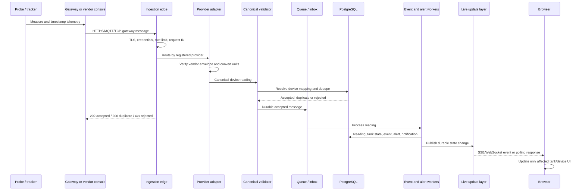

# SmartFuel Device Integration & Live Data Architecture

## Production Technical Blueprint

| Field | Value |
| --- | --- |
| **Document version** | 1.0 |
| **Date** | 2026-09-26 |
| **System** | SmartFuel Fuel Monitoring & Management Platform |
| **Status** | Production integration blueprint; current-state findings and required implementation plan |
| **Primary timezone for this document** | Africa/Dar_es_Salaam |
| **Audience** | Application developers, system integrators, IoT engineers, DevOps engineers, hardware technicians, security engineers, operations teams and future device vendors |
| **Repository inspected** | SmartFuel application checkout, including `PRD-FMS.pdf`, `README.md`, `docs/ERD.md`, `db/schema.sql`, `supabase/migrations/0001_initial.sql`, API routes, repositories, device adapters and fuel engine |

> **Scope note:** This is a documentation-only deliverable. No application source, database schema, records, seed data or deployment configuration was changed while creating it. The document describes the current checkout as inspected and marks future work explicitly.

---

## How to read this document

Every material statement is classified using the following vocabulary:

- **Existing** - present in the inspected SmartFuel source tree or documented schema.
- **Required** - implementation work needed before the capability can be considered production-ready for live hardware.
- **Vendor-specific** - dependent on a device, controller, gateway, firmware or manufacturer's protocol.
- **Recommended** - an engineering or operational improvement advised for a reliable production deployment.
- **TBD / Requires vendor documentation** - cannot be confirmed from the repository and must not be assumed during implementation.

The words **must**, **should** and **may** are normative:

- **Must** means the integration cannot safely go live without the behavior.
- **Should** means the behavior is the production recommendation, subject to an approved exception.
- **May** means an implementation option.

---

# 1. Current Implementation vs Production Requirements

The following table is the source-of-truth distinction between what is in the application now and what is still needed to connect real installations at scale.

| Component | Current state in the inspected codebase | Production requirement |
| --- | --- | --- |
| **Device registry** | **Existing.** `devices` stores organization, type (`fuel_probe` or `gps_tracker`), serial number, provider, model, firmware, station/tank/vehicle assignment, status, last-seen/read timestamps, signal, battery, IP address, an API-key hash and metadata. `GET/POST /api/devices` and `GET/PATCH/DELETE /api/devices/:deviceId` are implemented. | Add lifecycle controls, provisioning records, credential history, validation that a device has exactly the correct assignment, commissioning/test state and replacement workflow. Avoid hard deletion in normal operations. |
| **Device onboarding UI** | **Existing.** An authenticated administrator can register a device, choose fuel probe or GPS tracker, choose a provider from the provider registry, assign a tank or vehicle and receive a generated `dkey_...` key once. | Add a field workflow, connection test, test-reading approval, calibration capture and explicit activation. |
| **HTTP ingestion endpoint** | **Existing.** `POST /api/webhooks/device/[provider]` accepts a JSON body, authenticates a device key, selects a provider adapter, normalizes the payload and invokes `ingestReading`. | Version the public ingestion contract, add request size/rate limits, idempotency, durable acknowledgment semantics, raw-message quarantine/dead-letter handling and stronger timestamp/tenant validation. |
| **Provider adapter registry** | **Existing.** `src/server/integrations/providers.ts` defines `DeviceProvider`, `verify`, `normalize`, provider metadata and example payloads. Registered keys are `tectonic`, `veeder_root`, `generic_mqtt`, `queclink` and `teltonika`. | Treat the current adapters as integration scaffolding until each vendor payload, firmware, authentication and field mapping is verified against vendor documentation and a physical device. Add an adapter contract test suite. |
| **Canonical normalized reading** | **Existing.** `NormalizedReading` contains `ts`, `volumeLiters`, optional `levelMm`, `levelPercent`, `temperatureC`, `waterLevelMm`, `signal`, `batteryPct` and `raw`. | Add schema version, message ID, source/sequence metadata, received time, quality flags and a formal versioned contract. Keep organization, station and tank ownership server-enriched rather than trusted from the device payload. |
| **Fuel reading persistence** | **Existing.** `readings` is append-oriented and stores organization, tank, device, timestamp, volume in litres, level percentage, level millimetres, temperature in Celsius, water level, signal, battery and raw JSON. | Add a durable deduplication key/message ledger and late-arrival policy. Consider partitioning/time-series storage and a raw-payload retention tier at scale. |
| **Device/tank mapping** | **Existing.** A fuel probe is required to have a `tank_id`; a GPS tracker is required to have a vehicle assignment in the device creation API. Ingest derives the tank from the registered device rather than trusting a tank ID in the message. | Enforce organization/station/tank/vehicle consistency as a single server-side invariant and reject cross-tenant or cross-station assignments. Add mapping history. |
| **Tank calibration** | **Partial.** `tanks` has capacity, thresholds and current level fields. `fuel_types` has optional density. The current reading path requires a volume and accepts a level millimetre value; there is no calibration curve/table entity. | Add a calibration/profile service or perform a verified level-to-volume conversion in the gateway/adapter before ingestion. Store calibration version and audit changes. **Required for level-only probes.** |
| **Teltonika** | **Partial/scaffold.** A `teltonika` provider key exists and normalizes timestamp, RSSI and battery. The current adapter sets `volumeLiters` to `null`; it does not persist GPS coordinates in `NormalizedReading`. | Confirm the exact model, firmware, codec and fuel input. Implement a dedicated telematics/GPS ingestion path and, only where supported, a separate vehicle-fuel adapter. **Requires Teltonika documentation and device testing.** |
| **Veeder-Root TLS** | **Partial/scaffold.** A `veeder_root` adapter expects a `tanks` array and maps the first tank's volume, level, percentage, temperature, water and battery-like fields. The repository does not establish the actual TLS interface, protocol, licensing or API. | Obtain the exact TLS controller/interface documentation and build a supported gateway/poller. Handle every returned tank with explicit console-tank-to-SmartFuel-tank mappings. **Requires Veeder-Root documentation and site validation.** |
| **Generic MQTT** | **Not a live broker integration.** The provider registry has a `generic_mqtt` normalizer and an example topic, but the application has no MQTT client dependency, broker consumer, MQTT listener or MQTT-to-HTTP worker in the inspected source. | Use a managed or self-hosted MQTT broker plus an ingestion worker/bridge. Do not run a long-lived MQTT listener inside a Vercel request function. |
| **MQTT bridge** | **Not implemented.** No local queue, bridge agent or offline store exists in the application. | Deploy/configure a gateway that buffers locally, reconnects, preserves timestamps and sequence IDs, and forwards with at-least-once delivery. |
| **HTTP/REST devices** | **Existing only through the provider webhook shape.** The endpoint is a Next.js route, not a vendor-neutral `/api/v1/ingestion/readings` contract. | Keep the existing route as a compatibility path if needed, but introduce a versioned ingestion contract and vendor-specific adapters behind it. |
| **Raw TCP devices** | **Not existing.** No TCP listener or codec server is in the Next.js application. | Terminate TCP at a dedicated protocol gateway or vendor platform. Decode and authenticate there, then publish canonical messages over HTTPS or MQTT. |
| **Fuel event detection** | **Existing.** `classifyMovement` compares a new reading with the latest tank reading and creates refill, consumption or anomaly events using configured/default thresholds. | Make classification idempotent and reprocessable, handle late data deliberately, add explicit delivery/transaction correlation and test sensor accuracy limits. |
| **Alert engine** | **Existing for built-in live checks.** Ingest evaluates low, critical, overfill, water, temperature and suspected-loss conditions and creates durable alerts/notifications. Alert-rule CRUD also exists. | Complete the connection between configurable alert rules and the live ingestion path, enforce cooldowns, make alert creation idempotent and route notifications through a production delivery service. |
| **Device health** | **Existing.** `sweepDeviceHealth` marks stale devices and associated tanks offline, creates an offline alert, preserves the last valid reading and auto-restores on recovery. The default offline threshold is 10 minutes. | Run the sweep every minute or at a defined operational interval. The current Vercel Cron schedule is daily (`0 0 * * *`), which is not sufficient for a 10-minute offline SLA. Add a real heartbeat path where a vendor supports it. |
| **Live updates** | **Partial.** `GET /api/stream` is an authenticated, bounded SSE route that polls durable rows every three seconds and emits a `tick` snapshot. The inspected client source does not show a consumer for this route; notifications poll every 15 seconds. | Wire a client subscription with reconnect/stale state and relevant-tank updates, or provide a documented polling fallback. For multiple workers, add a durable event/fan-out layer rather than an in-process bus. |
| **Database** | **Existing.** Local development uses SQLite; production is designed for PostgreSQL/Supabase through the async repository adapter and external migrations. | Use PostgreSQL with backups, indexes, connection pooling and a queue/worker path for ingestion. Do not run schema creation or migrations during a production request. |
| **Monitoring** | **Partial.** There are health, audit, integration status/error fields and application logging. | Add structured device/message metrics, queue depth, ingestion latency, reject rate, stale-device metrics, alert lag, database health and vendor-specific dashboards. |
| **Security** | **Partial.** Per-device keys are generated, hashed with SHA-256 and shown once; user APIs have session/RBAC/rate-limit wrappers; one provider uses an HMAC signature check. | Add device endpoint rate limiting, replay protection, key rotation policy, secret management, mTLS where justified, MQTT ACLs, payload-size limits, security events and a formal credential/offboarding process. |
| **Production live readiness** | **Not confirmed.** The application has a credible normalized-ingestion foundation, but the vendor adapters and infrastructure have not been verified against live equipment in this repository. | Complete the required roadmap, test with a pilot station and obtain sign-off from application, IoT, security, operations and the hardware vendor. |

---

# 2. Executive Summary

SmartFuel monitors fuel tanks, stores the measurements reported by probes, derives fuel movements, evaluates operational alerts and presents station, tank, device and fleet information to authorized users. The product model intentionally separates **station tank fuel** from **vehicle fuel/GPS telemetry**. A tank probe is mapped to a tank; a GPS tracker is mapped to a vehicle.

A physical fuel probe measures one or more of the following:

- Product height or level in millimetres.
- Calculated or measured product volume.
- Percentage full.
- Product temperature.
- Water level.
- Device signal and battery information.

A local controller, gateway, vendor console or telematics device then sends the observation over a supported transport. SmartFuel authenticates the device, selects an adapter by provider key, converts vendor fields and units into the canonical reading shape, resolves the registered device to its server-side tank mapping, validates the observation against tank limits, stores the raw and normalized values, updates the tank/device state, classifies a movement and evaluates alerts.

The complete target journey is:

```text
Fuel Probe / Vehicle Sensor
        |
        v
Device, TLS Console, Telematics Unit or Local Gateway
        |
        +-- MQTT / HTTPS / REST / vendor API / TCP-to-gateway
        v
SmartFuel Device Ingestion Gateway
        |
        v
Device Authentication and Tenant Lookup
        |
        v
Vendor Adapter: verify -> parse -> convert -> normalize
        |
        v
Canonical Reading Contract
        |
        v
Server-side Device -> Organization -> Station -> Tank/Vehicle Mapping
        |
        v
Validation, Deduplication and Durable Acceptance
        |
        +------------------+
        v                  v
Raw/Normalized Storage   Processing Queue or Transaction
        |                  |
        v                  +--> Fuel Event Detection
        |                  +--> Alert Evaluation and Notifications
        v
Live Snapshot / Event Publication
        |
        v
SmartFuel Dashboard and Device Health Views
```

The current application already implements a useful core path for an authenticated HTTP device webhook and fuel-probe readings. It does **not** yet constitute a complete, vendor-certified production IoT platform. In particular, MQTT reception, offline gateways, raw TCP termination, GPS position persistence, message-level idempotency, calibration profiles and high-frequency device-health scheduling remain required or vendor-specific work.

---

# 3. System Inspection Findings and Boundaries

## 3.1 Application architecture that exists today

**Existing:**

- Next.js App Router application with server-rendered authenticated pages and client components.
- Node.js runtime requirement of `>=20.11.0`.
- REST-style route handlers under `src/app/api`.
- Database repositories under `src/server/db/repo`.
- Domain types in `src/server/domain/types.ts`.
- Fuel ingestion and classification in `src/server/engine/fuel.ts`.
- Provider adapters in `src/server/integrations/providers.ts`.
- Local SQLite adapter and production PostgreSQL adapter.
- Production deployment documentation oriented around Vercel and Supabase PostgreSQL.
- `POST /api/webhooks/device/[provider]` as the current hardware entry point.
- `GET /api/stream` as the current SSE snapshot route.

## 3.2 Data model that exists today

The relevant tables and relationships are:

```text
organizations
    |
    +-- stations
    |      |
    |      +-- tanks -- fuel_types
    |      |     |
    |      |     +-- readings
    |      |     +-- devices (fuel_probe)
    |      |
    |      +-- vehicles
    |            |
    |            +-- devices (gps_tracker)
    |
    +-- devices
    +-- fuel_events
    +-- alert_rules -> alerts -> alert_notes / notifications
    +-- integrations
    +-- system_settings
    +-- audit_logs
```

The important point is that the current `devices` record is both the credential identity and the mapping record. The ingestion route does not use an organization, station or tank supplied by an untrusted payload to decide where data goes. It looks up the device by the hash of its API key and then uses `device.tankId` for a fuel probe.

## 3.3 Boundaries that must not be blurred

1. **Station tank fuel is not vehicle fuel.** A tank probe reading must not be stored as a vehicle fuel reading, and a vehicle tracker’s fuel input must not silently replace a station tank reading.
2. **Raw telemetry is not a business event.** A raw measurement is immutable input; refill, consumption and anomaly records are derived interpretations.
3. **A device being online is not proof that its sensor value is valid.** Connectivity, data freshness and measurement quality must be displayed separately.
4. **An unexplained decrease is not automatically theft.** The current product language intentionally uses suspected anomaly/loss language and routes the case to a human.
5. **A provider adapter is not a vendor certification.** Current example payloads and `.example` documentation URLs are implementation scaffolding until verified with the manufacturer.

---

# 4. Architecture Principles

## 4.1 Vendor agnostic

The SmartFuel core must consume a canonical reading and device event contract. A new manufacturer should require a new adapter and operational configuration, not changes to tank dashboards, alert logic or every repository.

## 4.2 Protocol agnostic

The ingestion boundary should support:

- HTTPS/REST push.
- MQTT through a broker or gateway.
- Vendor HTTP APIs polled by an integration worker.
- Vendor TCP protocols terminated by a protocol gateway.
- WebSocket only where a vendor requires it; it is not the default browser-to-device design.
- Private APN or VPN links terminating at a controlled gateway.

The transport adapter ends at a normalized, authenticated message. The SmartFuel core should not know whether the reading arrived through MQTT, a Veeder-Root gateway, a Teltonika bridge or an HTTP request.

## 4.3 Server-owned identity and mapping

A device may identify itself with a serial number, IMEI, certificate or broker credential. It must not be allowed to choose another tenant, station or tank by placing an arbitrary `organizationId`, `stationId` or `tankId` in its payload. The server resolves the authenticated device to its registered assignment.

## 4.4 Normalized internal data

The core uses litres and Celsius at capture time. Display units are organization preferences and must not rewrite historical readings.

## 4.5 Immutable input and derived output

Store the original vendor payload and normalized reading separately from derived events and alerts. This supports audit, replay, adapter bug fixes and reclassification without rewriting what the hardware reported.

## 4.6 At-least-once delivery with idempotent processing

Real devices and gateways retry. The production system should acknowledge a message only after durable acceptance and must safely process the same message more than once without creating duplicate readings, movements, alerts or notifications.

## 4.7 Honest freshness

Every value exposed to an operator needs a timestamp and a quality/freshness state such as `live`, `delayed`, `offline`, `invalid` or `unknown`. The last valid value may remain visible, but it must not look current when the device is stale.

## 4.8 Infrastructure appropriate to serverless

The current web application is designed for Vercel-style short-lived functions. Long-lived MQTT subscriptions, raw TCP listeners and process-local event buses should run in dedicated workers or managed services, not inside a request function.

---

# 5. High-Level Production Architecture

## 5.1 Recommended logical architecture

```text
                         REAL WORLD
  +----------------+  +----------------+  +----------------------+
  | Fuel probe     |  | Veeder TLS     |  | Teltonika / telematics|
  | generic sensor |  | controller     |  | vehicle device        |
  +-------+--------+  +--------+-------+  +----------+-----------+
          |                    |                    |
          v                    v                    v
  +---------------------------------------------------------------+
  | Local gateway / vendor connector / private APN termination    |
  | Offline buffer, protocol decode, clock and secure credentials  |
  +-----------------------------+---------------------------------+
                                |
                 MQTT / HTTPS / REST / TCP gateway
                                |
                                v
  +---------------------------------------------------------------+
  | Ingestion edge                                                |
  | TLS, request limits, device auth, provider routing, rate limit |
  +-----------------------------+---------------------------------+
                                |
                                v
  +---------------------------------------------------------------+
  | Adapter workers                                               |
  | Teltonika | Veeder-Root | Generic MQTT | HTTP | future vendor |
  +-----------------------------+---------------------------------+
                                |
                                v
  +---------------------------------------------------------------+
  | Canonical message validation and device mapping               |
  | organization -> station -> tank or vehicle                    |
  +-----------------------------+---------------------------------+
                                |
                                v
  +----------------------+       +-------------------------------+
  | Durable message/raw  |------>| Processing queue / workers    |
  | telemetry storage    |       | events, alerts, notifications  |
  +----------+-----------+       +---------------+---------------+
             |                                   |
             v                                   v
  +----------------------+       +-------------------------------+
  | PostgreSQL /          |       | Live update projection        |
  | time-series indexes   |       | SSE gateway / polling fallback |
  +----------+-----------+       +---------------+---------------+
             |                                   |
             +----------------+------------------+
                              v
                    SmartFuel web dashboard
```

## 5.2 Current code path versus target path

```text
CURRENT HTTP FUEL-PROBE PATH

POST /api/webhooks/device/{provider}
        |
        +--> hash API key -> devices.api_key_hash
        +--> provider.normalize(payload)
        +--> ingestReading()
        +--> validate volume/capacity/temperature
        +--> insert readings with raw payload
        +--> update tank and device
        +--> classify movement
        +--> create alert/notification
        +--> return JSON result

TARGET PRODUCTION PATH

Device/gateway
        |
        +--> MQTT broker, HTTPS edge or TCP protocol gateway
        +--> durable ingress envelope and message ID
        +--> adapter worker
        +--> canonical message validator
        +--> dedupe/inbox
        +--> durable reading transaction
        +--> event/alert workers
        +--> durable live projection
        +--> SSE/WebSocket gateway or polling fallback
```

## 5.3 Target sequence diagram



---

# 6. Device Integration Model and Lifecycle

## 6.1 Register the device

**Existing workflow:** an authorized user opens Devices, chooses `fuel_probe` or `gps_tracker`, selects a provider, enters serial number/model/firmware, assigns a station and tank or vehicle, and submits `POST /api/devices`. SmartFuel generates a per-device key, stores only its SHA-256 hash and returns the raw key exactly once.

**Required production controls:**

- Record the manufacturer, exact model, firmware, hardware revision and installation location.
- Record the protocol and transport separately from the vendor name.
- Record the provisioning date, installer and commissioning ticket.
- Generate a credential with an expiry/rotation policy.
- Require confirmation that the credential was installed before activation.
- Do not use a shared organization-wide key for multiple devices.

Example registry record (conceptual; fields marked `required` are not all current columns):

```json
{
  "serialNumber": "PROBE-001",
  "provider": "generic_mqtt",
  "model": "TBD",
  "firmware": "TBD",
  "type": "fuel_probe",
  "transport": "mqtt",
  "organizationId": "server-owned",
  "stationId": "station_001",
  "tankId": "tank_001",
  "commissioningStatus": "test_pending",
  "credentialId": "cred_001"
}
```

## 6.2 Assign the device

The assignment chain must be explicit:

```text
Device
  -> Organization
  -> Station
  -> Tank       for a station fuel probe

Device
  -> Organization
  -> Station/home location
  -> Vehicle    for a GPS tracker
```

A fuel probe must have one active tank mapping at a time. A tank may have a replacement history, but two active probes should not write competing current values to the same tank unless a deliberate multi-sensor strategy has been implemented.

## 6.3 Authenticate

The current HTTP route supports the following mechanisms in the inspected code:

- A generated device API key supplied in `x-api-key`, `x-device-key` or `Authorization: Bearer ...`.
- SHA-256 lookup against `devices.api_key_hash`.
- Constant-time comparison of the presented key hash.
- An additional provider signature check for providers whose adapter metadata says `authMethod: "hmac"`.

The current Tectonic adapter computes an HMAC-SHA-256 signature over the raw request body. The current route passes the device API key as the provider secret. This is an implementation detail that must be confirmed or redesigned with the vendor before production; it is not proof that a real Tectonic device uses that scheme.

The production authentication choice depends on the vendor:

| Mechanism | Use when | Status in current app |
| --- | --- | --- |
| Per-device API key | Device/gateway can send an HTTPS header and keys can be provisioned securely | **Existing baseline** |
| HMAC-signed body | Vendor/gateway can sign exact raw bytes and rotate a shared secret | **Partial; one adapter path** |
| MQTT username/password | MQTT broker ACL is the identity boundary | **Required for MQTT broker** |
| mTLS client certificate | High-assurance private fleet or gateway deployment | **Recommended where supported; not existing** |
| Vendor OAuth/API credential | SmartFuel polls a vendor cloud API | **Vendor-specific/TBD** |
| Private APN/VPN/IP allowlist | Network-level isolation is available | **Recommended defense in depth; not sufficient alone** |

## 6.4 Receive, validate, normalize, persist and process

The canonical sequence is:

```text
1. Receive bytes
2. Capture request ID, provider, route, source IP and receivedAt
3. Authenticate before expensive parsing
4. Parse the vendor payload
5. Adapter validates vendor-specific required fields
6. Convert units and timestamps
7. Resolve device by server-side credential identity
8. Resolve station/tank or vehicle from the device record
9. Validate canonical ranges and tenant ownership
10. Deduplicate by message ID/sequence/fingerprint
11. Persist raw message and accepted normalized reading
12. Update current tank/device projection
13. Derive fuel event(s)
14. Evaluate alert rules and notifications
15. Publish a durable state change
16. Acknowledge the message to the sender
```

The current application implements steps 3, 4, 7, 8, 9, 11, 12, 13 and part of 14 synchronously for fuel probes. It does not yet implement a durable message inbox or complete production queue semantics.

---

# 7. Canonical Device Payload and Internal Contract

## 7.1 Current normalized type

The current internal adapter contract is:

```ts
interface NormalizedReading {
  ts: string;
  volumeLiters: number | null;
  levelMm?: number | null;
  levelPercent?: number | null;
  temperatureC?: number | null;
  waterLevelMm?: number | null;
  signal?: number | null;
  batteryPct?: number | null;
  raw?: Record<string, unknown>;
}
```

`ingestReading` currently requires `volumeLiters` to be present and valid for a fuel probe. If `levelPercent` is absent, it derives it as `volumeLiters / tank.capacity * 100`.

## 7.2 Persisted current reading

The current `Reading` domain object adds:

```text
id, ts, createdAt, organizationId, tankId, deviceId,
volumeLiters, levelPercent, levelMm, temperatureC,
waterLevelMm, signal, batteryPct, raw
```

The `readings` table does not currently contain a message ID, sequence number, protocol, received timestamp, adapter version, quality code or duplicate key.

## 7.3 Recommended versioned envelope

The following is the recommended contract between an adapter and SmartFuel Core. It is a target contract, not an assertion that every field currently exists in the database.

```json
{
  "schemaVersion": "1.0",
  "messageId": "msg_01J...",
  "sequence": 18421,
  "receivedAt": "2026-09-26T15:30:01.204Z",
  "source": {
    "provider": "generic_mqtt",
    "protocol": "mqtt",
    "adapterVersion": "generic_mqtt@1.0.0",
    "topic": "smartfuel/org_001/PROBE-001/telemetry"
  },
  "device": {
    "id": "dev_001",
    "serialNumber": "PROBE-001",
    "type": "fuel_probe",
    "provider": "generic_mqtt"
  },
  "mapping": {
    "organizationId": "org_001",
    "stationId": "station_001",
    "tankId": "tank_001"
  },
  "reading": {
    "timestamp": "2026-09-26T15:30:00Z",
    "volumeLiters": 4950,
    "levelPercent": 49.5,
    "levelMillimeters": 1240,
    "temperatureC": 28.4,
    "waterLevelMillimeters": 2
  },
  "connectivity": {
    "signal": 92,
    "batteryPercent": 87,
    "firmware": "1.8.4"
  },
  "quality": {
    "isEstimatedVolume": false,
    "calibrationVersion": "cal_2026_01",
    "flags": []
  },
  "raw": {
    "vendorPayloadPreserved": true
  }
}
```

### Field classification

| Field | Required? | Current status | Rules |
| --- | --- | --- | --- |
| `schemaVersion` | Required in target contract | Not current | Version every adapter-to-core payload. |
| `messageId` | Required for production | Not current | Stable across retries; generated by device/gateway where possible. |
| `sequence` | Optional but strongly recommended | Not current | Monotonic per device; useful for offline replay and ordering. |
| `receivedAt` | Required for operations | Not current | Server/gateway receipt time; never replace measurement time. |
| `provider`, device identity | Required | Partially current | Provider comes from URL/adapter and device identity comes from credentials/serial. |
| `organizationId`, `stationId`, `tankId` | Server-enriched required | Not trusted from current device payload | Resolve from the registered device. Do not accept arbitrary tenant IDs from the sender. |
| `timestamp` | Required | Current `ts` | Normalize to UTC ISO-8601 and reject invalid/future-skewed values according to policy. |
| `volumeLiters` | Required by current fuel path | Existing | Must be finite and non-negative; if derived, retain quality/calibration metadata. |
| `levelPercent` | Optional/derived | Existing | Validate 0-100 when supplied; derive only when volume and capacity are trustworthy. |
| `levelMillimeters` | Optional | Existing as `levelMm` | May be the primary sensor output for a level-only probe, but current core still requires volume. |
| `temperatureC` | Optional | Existing | Normalize Fahrenheit to Celsius in the adapter. |
| `waterLevelMillimeters` | Optional | Existing | Preserve `null` when unsupported; do not turn missing into zero. |
| `batteryPercent`, `signal` | Optional | Existing | Do not infer a battery or signal value from absence. |
| `raw` | Required for audit where permitted | Existing | Store vendor payload with secret fields redacted. Never store credentials in raw JSON. |
| `quality`, calibration and firmware | Required for high-assurance deployments | Not current | Add to envelope/metadata before pilot. |

## 7.4 Device message versus browser/API payload

The browser-facing device registry API is not the same thing as the hardware telemetry contract. The device should send only the fields required by its adapter. SmartFuel should add server-owned IDs and operational metadata after authentication. A device-provided `stationId` or `tankId` may be retained in raw data for diagnostics, but it must not override the registered mapping.

---

# 8. Vendor Adapter Architecture

## 8.1 Adapter responsibilities

Each adapter is responsible for:

1. Identifying the supported provider and transport.
2. Verifying vendor-specific authentication/signatures.
3. Parsing vendor payloads without leaking parser failures as 500 errors.
4. Resolving vendor device identity to a SmartFuel device credential/serial.
5. Converting units and timestamp conventions.
6. Mapping vendor tank/channel identifiers to SmartFuel tank IDs.
7. Producing the canonical contract.
8. Preserving a redacted raw payload and adapter version.
9. Returning explicit unsupported-field/quality flags.
10. Supplying fixtures and contract tests for every supported model/firmware combination.

The adapter must not update a tank, create an alert or make a theft determination. Those are SmartFuel core responsibilities.

## 8.2 Adapter shape

```text
                 +--------------------------+
                 | SmartFuel ingestion core |
                 | mapping, validation,     |
                 | storage, events, alerts  |
                 +------------+-------------+
                              ^
                              | CanonicalReading
       +----------------------+----------------------+
       |                      |                      |
+------+-+              +-----+------+         +-----+------+
| MQTT   |              | Veeder     |         | Teltonika  |
| adapter|              | adapter    |         | adapter    |
+---+----+              +-----+------+         +-----+------+
    ^                         ^                      ^
    |                         |                      |
 MQTT broker            TLS gateway/API       vendor bridge/API/TCP
```

## 8.3 Existing provider registry

The inspected registry contains these keys:

| Key | Current declared kind | Current behavior | Production status |
| --- | --- | --- | --- |
| `tectonic` | `fuel_probe` | HMAC signature check and maps common volume/level/temperature/water fields | Reference/scaffold; vendor documentation URL is an `.example` URL and requires verification |
| `veeder_root` | `fuel_probe` | Reads the first object in `tanks` and maps common names | Scaffold; exact TLS interface and multi-tank behavior require vendor documentation |
| `generic_mqtt` | `fuel_probe` | Maps normalized JSON field aliases; current route still receives HTTP JSON | Adapter fixture only until an MQTT broker/bridge exists |
| `queclink` | `gps` | Maps timestamp, signal and battery; no position persistence in the canonical type | Requires separate GPS/vehicle path and vendor verification |
| `teltonika` | `gps` | Maps timestamp, RSSI and battery; sets volume to `null` | Requires exact model/protocol documentation and a GPS path |

The current provider `docsUrl` values for vendor examples are not evidence of a real vendor contract. They must be replaced with verified documentation references in the implementation record.

## 8.4 New-vendor rule

Adding a manufacturer must follow this pattern:

```text
Vendor documentation and test hardware
        -> protocol and identity review
        -> adapter fixture payloads
        -> parser and unit tests
        -> canonical contract mapping
        -> security review
        -> replay/duplicate/offline tests
        -> pilot deployment
        -> provider registry entry
```

No new vendor should require changing the tank UI, alert UI, movement UI or every database repository.

---

# 9. Teltonika Integration

## 9.1 What is known from this repository

**Existing:** the provider registry contains a `teltonika` key named `Teltonika FMC`, declared as GPS, with support flags for signal, battery, ignition and odometer. The current normalizer reads a timestamp and signal/battery aliases but returns `volumeLiters: null`. The canonical `NormalizedReading` type has no latitude, longitude, speed, ignition or odometer fields. The current fuel ingestion engine rejects a device that is not a fuel probe and rejects a normalized payload without volume.

Therefore, the current Teltonika adapter is **not a complete end-to-end Teltonika GPS integration**. A Teltonika payload sent to the fuel-probe path would not produce a stored GPS position and will normally fail because no volume is available.

## 9.2 Model and protocol identification

**TBD / Requires Teltonika vendor documentation:**

- Exact device model and product family.
- Firmware version and enabled codec.
- Whether the unit communicates directly with a SmartFuel-owned TCP server, a vendor platform, an integrator platform or a local gateway.
- Which fuel input is connected: analog, CAN, 1-Wire, external sensor, serial accessory or another interface.
- Scaling, calibration and engineering units for the fuel input.
- How the unit reports IMEI/serial identity, timestamps, RSSI, battery, ignition and odometer.
- Whether the unit supports HTTPS/MQTT directly or requires a TCP decoder/bridge.
- Vendor licensing, APN and SIM requirements.

The current source comment mentions an FMC/Codec 8 bridge, but this must be treated as an implementation hint, not as a production protocol commitment until the exact device and firmware are verified.

## 9.3 Recommended Teltonika paths

### GPS-only path

```text
Teltonika device
    -> vendor protocol gateway or approved telematics platform
    -> Teltonika adapter
    -> GPS/vehicle canonical event
    -> vehicle position/history and device health
```

The GPS contract should contain at least latitude, longitude, event time, received time, speed, heading where available, ignition, odometer, external power, RSSI, battery and source quality. This requires a separate vehicle telemetry model or an explicitly extended event model; it must not be forced into a tank `Reading`.

### Vehicle-fuel path

```text
Fuel sensor attached to vehicle
    -> Teltonika input / gateway
    -> vendor payload with calibrated fuel field
    -> Teltonika vehicle-fuel adapter
    -> vehicle fuel domain
```

A vehicle-fuel reading must remain distinct from a station tank reading. It may later be correlated with a station visit or delivery route, but it cannot update the station tank volume without an explicit business relationship and reconciliation rule.

## 9.4 Teltonika adapter implementation requirements

- Decode raw vendor frames only in a dedicated gateway/worker if TCP is used.
- Verify IMEI/device identity against the registered device.
- Preserve the original frame or a redacted decoded payload.
- Normalize device time and server receipt time separately.
- Convert fuel units only after confirming the input configuration.
- Reject or quarantine payloads with invalid coordinates, impossible speed or invalid sequence values.
- Handle retransmission and out-of-order frames using vendor sequence/message fields where available.
- Store a GPS heartbeat even when no fuel value was reported.
- Expose `gps_offline` independently of a tank probe status.

---

# 10. Veeder-Root TLS Integration

## 10.1 What is known from this repository

**Existing:** the `veeder_root` provider key is declared as a fuel-probe adapter. Its example payload contains a console ID and a `tanks` array. The normalizer takes the first tank object and maps fields such as `volume`, `grossVolume`, `level`, `fuelHeight`, `percentFull`, `temperature`, `waterLevel` and `batteryLevel` when present.

This is a code-level shape only. The repository does not confirm that a real Veeder-Root TLS controller emits this JSON, exposes these names, supports a particular HTTP API, or permits the proposed authentication method.

## 10.2 Target architecture

```text
Veeder-Root TLS console and probes
              |
              | Vendor-supported interface/API/gateway
              v
     Site connector or approved vendor integration
              |
              | HTTPS/MQTT over TLS, private link or controlled poller
              v
       SmartFuel Veeder adapter
              |
              v
    Console/tank mapping and canonical reading
              |
              v
       SmartFuel ingestion core
```

## 10.3 Questions that must be answered by the vendor/site

**TBD / Requires Veeder-Root documentation:**

- Exact TLS console model and firmware.
- Supported external interface, protocol, API, SDK or gateway.
- Whether polling, push notifications or a vendor cloud API is supported.
- Required licensing and integration modules.
- TLS/network configuration and certificate requirements.
- Console identifier and tank/probe identifiers.
- Units, temperature compensation and volume definition.
- Whether volume is gross, corrected, net or temperature-compensated.
- Water-level measurement and alarm semantics.
- Console alarm/event payloads and acknowledgement behavior.
- Retry, rate limit and historical backfill behavior.
- Site network restrictions, private APN/VPN requirements and support boundaries.

## 10.4 Multi-tank requirement

The current adapter selects the first tank in a `tanks` array. That is not safe for a real console with multiple tanks. The production adapter must:

1. Authenticate the console/gateway.
2. Identify the specific vendor tank number/channel.
3. Look up a configured mapping such as `(integrationId, consoleId, vendorTankNumber) -> tankId`.
4. Reject an unmapped tank instead of assigning it by array position.
5. Process each tank as an independent canonical reading.
6. Preserve console-level alarms separately from tank measurements.
7. Keep the historical mapping when a probe is replaced.

## 10.5 Veeder reading fields

| Vendor concept | SmartFuel target | Current status |
| --- | --- | --- |
| Product volume | `volumeLiters` | Current canonical field; exact vendor definition TBD |
| Product level | `levelMm` | Current optional field |
| Percentage full | `levelPercent` | Current optional field; validate against SmartFuel capacity |
| Product temperature | `temperatureC` | Current optional field; unit conversion required if not Celsius |
| Water level | `waterLevelMm` | Current optional field |
| Console/tank alarm | Alert/event metadata | Required adapter work; no dedicated current console-alarm contract |
| Vendor tank number | Mapping key, not trusted destination | Required configuration |

---

# 11. Generic MQTT Integration

## 11.1 Current status

The repository has a `generic_mqtt` provider normalizer and an example topic of `smartfuel/readings/{deviceSerial}`. There is no MQTT broker configuration, MQTT client library, subscription worker or bridge process in the inspected application. The current provider code can therefore be reused behind an HTTP gateway, but it is not a live MQTT integration by itself.

## 11.2 Recommended broker topology

```text
Device / station gateway
        |
        | MQTT over TLS
        v
Managed MQTT broker or dedicated broker cluster
        |
        | Authorized subscription
        v
SmartFuel MQTT adapter worker
        |
        | canonical envelope
        v
SmartFuel ingestion queue/API
```

### Broker options

| Option | Advantages | Trade-offs | Recommendation |
| --- | --- | --- | --- |
| Managed MQTT service | TLS, scaling, ACLs, monitoring and HA are available without operating brokers | Vendor cost and service dependency | **Recommended for first production rollout** unless a customer requires on-premises |
| Self-hosted MQTT cluster | Full control and private deployment | Patching, HA, certificates, backups and operations become SmartFuel responsibility | Use only with an explicit DevOps ownership model |
| Station-local broker plus bridge | Works during WAN outages and isolates local devices | Requires gateway lifecycle, disk management and secure forwarding | **Recommended for unreliable station links** |
| Direct MQTT in Next.js/Vercel | Minimal apparent components | Long-lived connection is unsuitable for short-lived serverless functions | **Do not use** |

## 11.3 Topic design

A target topic design is:

```text
smartfuel/v1/{organizationId}/{deviceId}/telemetry
smartfuel/v1/{organizationId}/{deviceId}/heartbeat
smartfuel/v1/{organizationId}/{deviceId}/event
smartfuel/v1/{organizationId}/{deviceId}/status
```

The current example topic is `smartfuel/readings/{deviceSerial}`. A compatibility subscription may support it, but the broker ACL and authenticated device identity must remain authoritative. Do not trust a topic organization ID as tenant proof.

## 11.4 Example MQTT telemetry

```json
{
  "schemaVersion": "1.0",
  "messageId": "PROBE-001-18421",
  "sequence": 18421,
  "timestamp": "2026-09-26T18:30:00Z",
  "volumeLiters": 4950,
  "levelPercent": 49.5,
  "levelMm": 1240,
  "temperatureC": 28.4,
  "waterLevelMm": 2,
  "signal": 92,
  "batteryPct": 87
}
```

A gateway may publish a vendor-native payload instead, but then the MQTT adapter must explicitly map it. The core must never infer fields from arbitrary keys without a provider contract.

## 11.5 MQTT operational rules

- **QoS:** use QoS 1 for telemetry that must survive ordinary network retries. QoS 2 may be used where the device/broker supports it and throughput permits, but it does not replace application-level idempotency.
- **Retained telemetry:** do not retain normal telemetry messages unless the consumer has an explicit stale-message policy. A newly subscribed worker must not treat an old retained reading as a new measurement.
- **Last Will and Testament:** publish a device/gateway offline status where the device can support it. Treat LWT as a connectivity hint, not as proof of sensor validity.
- **Keepalive:** configure according to the device and cellular network; monitor disconnect/reconnect counts.
- **TLS:** use broker TLS, validate the CA and rotate certificates. Plaintext MQTT is not acceptable on the public internet.
- **Authentication:** use per-device credentials or client certificates. Do not share one password across a station fleet.
- **ACLs:** restrict each device to its own publish topic; ingestion workers may subscribe only to the required namespace.
- **Message IDs:** carry a stable message ID and device sequence. The SmartFuel inbox must deduplicate retries.
- **Payload size:** set broker and edge limits to prevent oversized or malicious messages.
- **Clock:** preserve device measurement time and gateway/server receipt time.
- **Backpressure:** use queue depth and consumer lag metrics; do not acknowledge faster than the durable handoff can support.

---

# 12. Generic MQTT Bridge and Offline Station Operation

## 12.1 Bridge architecture

```text
Fuel probe or local controller
            |
            v
Station gateway / edge agent
  - local protocol conversion
  - disk-backed queue
  - clock and sequence preservation
  - device credential storage
            |
            | MQTT over TLS after reconnect
            v
Internet / private APN / VPN
            |
            v
MQTT broker
            |
            v
SmartFuel adapter worker
```

## 12.2 Required bridge behavior

1. Accept the probe’s local protocol only after vendor/hardware validation.
2. Assign or preserve a stable device identity.
3. Add `messageId`, sequence and gateway receipt time if the probe lacks them.
4. Persist a bounded local queue on durable storage before reporting success to the local source.
5. Retry with exponential backoff and jitter.
6. Maintain queue age, queue depth and disk-space metrics.
7. Send oldest messages first after reconnect.
8. Preserve original measurement timestamps; do not rewrite buffered readings to the send time.
9. Accept duplicate acknowledgments without deleting future messages.
10. Support remote credential rotation without exposing secrets in logs.
11. Protect the gateway operating system and update mechanism.
12. Provide a quarantine path for payloads that SmartFuel rejects.

## 12.3 Message acknowledgment

The bridge should delete a queued message only after SmartFuel returns one of:

- `200 accepted` - newly accepted and processed/queued durably.
- `200 duplicate` - already durably accepted; safe to remove from the bridge queue.
- A documented `202 accepted` - durably queued for later processing.

It must retain and retry on 5xx, network timeout and broker disconnect. It must not blindly retry permanent 400/401/403/404/409/422 errors; those go to a diagnostic queue and alert.

---

# 13. HTTP / REST Device Integration

## 13.1 Current endpoint

The current code implements:

```http
POST /api/webhooks/device/{provider}
Content-Type: application/json
x-api-key: dkey_...
```

The route returns the standard SmartFuel API envelope:

```json
{
  "ok": true,
  "data": {
    "ok": true,
    "reading": {},
    "event": null,
    "alerts": []
  }
}
```

This endpoint is existing, but it is not yet a formally versioned public vendor contract.

## 13.2 Current example request

```http
POST /api/webhooks/device/generic_mqtt HTTP/1.1
Host: fuel.example.com
Content-Type: application/json
x-device-key: dkey_REDACTED

{
  "timestamp": "2026-09-26T18:30:00Z",
  "volumeLiters": 4950,
  "levelPercent": 49.5,
  "levelMm": 1240,
  "temperatureC": 28.4,
  "waterLevelMm": 2,
  "signal": 92,
  "batteryPct": 87
}
```

## 13.3 Recommended versioned contract

**Required implementation:** expose a versioned contract such as:

```http
POST /api/v1/ingestion/readings
Authorization: Bearer DEVICE_TOKEN
Idempotency-Key: PROBE-001-18421
X-Provider: generic_mqtt
X-Device-Serial: PROBE-001
Content-Type: application/json
```

A compatibility adapter may translate this request to the current provider route during migration. The public documentation must not suggest that `/api/v1/ingestion/readings` already exists; it is a **Required implementation** endpoint unless it is explicitly added later.

## 13.4 Response and retry policy

Recommended response meanings:

| HTTP status | Meaning | Sender behavior |
| --- | --- | --- |
| `200` | Accepted or recognized duplicate | Mark message complete; do not resend the same message. |
| `202` | Durably queued, processing not yet complete | Remove only after durable response; retain message ID for status/retry reconciliation. |
| `400` | Invalid envelope or unsupported content | Do not retry without configuration correction. |
| `401` | Credential missing/invalid | Stop or slow retry; rotate/reprovision after operator action. |
| `403` | Device disabled or forbidden | Quarantine and alert. |
| `404` | Provider/route unknown | Configuration error; do not retry indefinitely. |
| `409` | Unknown/unassigned/misconfigured device or mapping conflict | Quarantine and require operator action. |
| `422` | Payload cannot be normalized or fails validation | Preserve diagnostic copy; do not retry unchanged. |
| `429` | Rate limited | Retry with `Retry-After` and backoff. |
| `5xx` | Temporary server/infrastructure failure | Retry with exponential backoff and jitter. |

The current route uses `401`, `404`, `409` and `422` for the corresponding cases and may return `500` for an unhandled server error. A production contract should add request IDs and explicit duplicate responses.

## 13.5 Idempotency

The current route does not accept a documented idempotency key. The production API must support a stable device message ID, sequence or a server-computed fingerprint. The same message retry must not create a second `readings` row or a second refill/alert.

---

# 14. Raw TCP Device Integration

**Existing:** no TCP listener is present in the Next.js application.

**Required architecture:**

```text
Vendor TCP device
       |
       v
Dedicated TCP/TLS protocol gateway
       |
       +--> vendor frame decoder
       +--> device identity/authentication
       +--> sequence and replay checks
       +--> raw frame archive
       |
       v
HTTPS or MQTT canonical message
       |
       v
SmartFuel ingestion workers
```

The TCP gateway must not be implemented as an ordinary browser-facing API route. It needs:

- A stable listening service or approved vendor cloud endpoint.
- Connection lifecycle limits and idle timeouts.
- TLS/mTLS if the vendor supports it.
- Per-device identity and protocol handshake validation.
- Frame length and parser bounds.
- Vendor codec/version negotiation.
- Replay and sequence checks.
- Raw frame correlation to canonical message ID.
- Health metrics for open connections and decoder failures.

**TBD / Requires vendor documentation:** every binary frame layout, handshake, checksum, codec, keepalive and command/acknowledgment rule for Teltonika or another TCP vendor.

---

# 15. Live Data Pipeline

## 15.1 Expected timing model

The system must measure latency rather than promise an unsupported fixed number. Define these timestamps:

- `measuredAt` - when the probe measured the value.
- `deviceSentAt` - when the device/gateway attempted transmission, if available.
- `receivedAt` - when SmartFuel edge received bytes.
- `acceptedAt` - when the message was durably accepted.
- `processedAt` - when tank/event/alert projections completed.
- `publishedAt` - when the live layer exposed the update.
- `displayedAt` - browser-side observation time.

Target operational objectives should be agreed during the pilot, for example:

```text
p95 acceptedAt - receivedAt:       < 2 seconds
p95 processedAt - acceptedAt:      < 5 seconds
p95 displayedAt - publishedAt:     < 2 seconds
offline detection:                 <= configured timeout + sweep interval
```

These are recommended objectives, not current guarantees.

## 15.2 Example timeline

```text
18:30:00.000  Probe measures 4,950 L
18:30:00.300  Gateway queues message
18:30:01.100  Ingestion edge receives HTTPS/MQTT message
18:30:01.130  Credentials and adapter validation complete
18:30:01.250  Message is durably accepted
18:30:01.500  Reading and tank projection stored
18:30:01.600  Event/alert processing completes
18:30:01.700  Live projection records tank change
18:30:02.000  Browser receives update or next polling response
```

## 15.3 Current pipeline behavior

The current HTTP fuel path processes reading, tank update, movement classification and built-in alert checks inside the request execution. It returns the result directly. This is convenient for a first integration but couples sender response time to database and processing work. A production queue should split durable acceptance from downstream processing while retaining a clear status model.

---

# 16. Live Frontend Updates

## 16.1 Existing SSE route

`GET /api/stream` currently:

- Requires an authenticated SmartFuel session.
- Runs on the Node.js runtime.
- Has a maximum duration of 60 seconds.
- Sends a `retry: 3000` instruction.
- Emits a `tick` event immediately and every three seconds.
- Reads durable tank and station snapshots from the database.
- Includes `totalFuel`, per-tank `tankId`, `levelPercent`, `volumeLiters`, `state`, `ts` and station status.
- Recommends client reconnect after the bounded lifetime.

It is a snapshot stream, not a vendor/device stream, and it currently does not expose a dedicated alert event in the route payload. The inspected client source does not show an active consumer for `/api/stream`; notification UI uses a 15-second fetch interval.

## 16.2 Recommended browser behavior

The dashboard should subscribe once at the authenticated app shell or a data provider layer. On a `tank.updated` event it should update only the affected tank query/cache entry. It must not reload the full page or all station data.

```json
{
  "event": "tank.updated",
  "data": {
    "tankId": "tank_001",
    "volumeLiters": 5060,
    "levelPercent": 50.6,
    "status": "normal",
    "measuredAt": "2026-09-26T18:30:00Z",
    "receivedAt": "2026-09-26T18:30:01Z",
    "freshness": "live"
  }
}
```

## 16.3 Transport comparison

| Transport | Strengths | Weaknesses | SmartFuel decision |
| --- | --- | --- | --- |
| **SSE** | Simple browser API, one-way server-to-browser updates, works well for dashboard events | Connection duration is bounded on serverless; reconnect is required | **Current and recommended initial browser transport**, with reconnect and stale state |
| **WebSocket** | Bidirectional and efficient for large interactive fleets | Requires a stateful gateway or managed service; more operational complexity | Use only if scale or interactive control requires it |
| **Polling** | Simple, robust across serverless and outages | Higher latency and repeated reads | **Required fallback** and appropriate for notifications/current snapshots |
| **MQTT-to-WebSocket** | Natural for IoT ecosystems | Exposes broker concerns to the browser and complicates tenant ACLs | Do not expose the raw broker to browsers; use an authenticated SmartFuel projection gateway |

## 16.4 Failure behavior

- If the stream closes, show `reconnecting` rather than silently freezing values.
- After a bounded number of failures, use polling.
- Show the last update time and stale banner.
- Reconcile the current snapshot after reconnect to avoid missed events.
- Do not show a zero or fabricated value when the live channel fails.

---

# 17. Device Heartbeat and Offline Detection

## 17.1 Separate status concepts

A device needs at least these independently evaluated concepts:

```text
Connectivity: online | delayed | offline | never_connected
Measurement quality: valid | invalid | missing | estimated | sensor_fault
Assignment: assigned | unassigned | mapping_error
Activation: active | disabled | retired
```

A device can be online while reporting an invalid temperature or impossible volume. A device can be offline while its last valid fuel value remains visible as stale.

## 17.2 Existing behavior

- Device status begins as `never_connected`.
- A valid fuel reading sets the device online and updates `lastSeenAt`/`lastReadingAt`.
- Invalid readings create an `invalid_reading` alert and set the device to `fault`.
- `sweepDeviceHealth` uses the configured `deviceOfflineMinutes` value, defaulting to 10 minutes.
- A stale device is marked offline; an associated tank is marked offline; an alert is created; the last valid reading is preserved.
- A later valid reading or a health sweep can restore the device/tank and resolve the offline alert.

## 17.3 Current scheduling gap

The checked-in Vercel configuration schedules `/api/cron/maintenance` at `0 0 * * *`, once per day. A daily invocation cannot reliably detect a ten-minute outage. Before a production go-live, the maintenance sweep must run at an interval compatible with the configured timeout, such as every minute or every five minutes, or be moved to a durable worker/scheduler. This is a **Required infrastructure change**, not a frontend setting.

## 17.4 Heartbeat endpoint

There is currently no separate `POST /api/v1/devices/heartbeat` route. A future endpoint may accept connectivity-only messages:

```json
{
  "messageId": "hb-PROBE-001-18422",
  "timestamp": "2026-09-26T18:35:00Z",
  "signal": 91,
  "batteryPct": 86,
  "firmware": "1.8.4"
}
```

It must update last-seen connectivity without overwriting the last fuel measurement or marking a sensor measurement valid.

---

# 18. Data Validation

## 18.1 Current validation

The current `validateReading` implementation rejects:

- Missing or non-numeric `volumeLiters`.
- Negative volume.
- Volume above 105% of the registered tank capacity.
- Temperature below -40°C or above 90°C.

The current pipeline also rejects:

- Unknown device.
- A GPS tracker sent through the fuel-probe ingestion path.
- An unassigned probe.
- A missing assigned tank or station.
- A timestamp older than the latest stored tank reading.

Invalid readings generate an alert and are not inserted into normal readings.

## 18.2 Required production rules

Validate before durable business processing:

| Field | Required rule |
| --- | --- |
| Device identity | Credential must resolve to an active registered device. |
| Provider | URL/topic/provider identity must match the registered device provider. |
| Organization | Device organization must equal the resolved tank/vehicle organization. Enforce explicitly, not only by separate foreign keys. |
| Mapping | A fuel probe must resolve to exactly one active tank; a GPS tracker must resolve to a vehicle. |
| Timestamp | Parse strictly, require a valid UTC-normalizable timestamp, apply future/past skew policy and retain server receipt time. |
| Volume | Finite, non-negative, within capacity policy; include an estimated/quality flag if derived. |
| Percentage | If supplied, finite and between 0 and 100; cross-check against volume/capacity within tolerance. |
| Level millimetres | Finite and within configured probe/tank range; reject impossible negative values unless the vendor defines an offset and it is normalized. |
| Temperature | Apply both physical safety bounds and organization/tank operating bounds. |
| Water | Finite and non-negative; preserve `null` when unsupported. |
| Signal/battery | Validate vendor range; do not treat absent as zero. |
| Raw body | Enforce size limit, redact credentials and preserve a correlation ID. |
| Schema | Reject unknown mandatory schema versions; safely ignore documented optional extensions. |

## 18.3 Invalid-data handling

Never silently coerce an invalid value to zero or the current value. Instead:

1. Store a rejection record or dead-letter message with the reason.
2. Create a device/integration diagnostic event.
3. Set device status to `fault` only when the policy says repeated/serious invalid data warrants it.
4. Preserve the last valid tank reading and clearly mark it stale or unchanged.
5. Notify the operator according to severity.
6. Allow an authorized replay after correcting the adapter or mapping.

---

# 19. Duplicate and Out-of-Order Readings

## 19.1 Current behavior and gap

The current engine compares the incoming timestamp to the latest stored tank reading and rejects an older timestamp as `duplicate`. It does not currently expose a stable message ID/sequence key, and two retries with the same timestamp and values can create duplicate rows. This is not sufficient for offline-buffered production gateways.

## 19.2 Recommended idempotency key

Preferred order:

```text
provider + device_id + vendor_message_id
provider + device_id + sequence_number
provider + device_id + measurement_timestamp + payload_fingerprint
```

The key must be calculated before business event creation. Store the result in a durable inbox/message table with a unique constraint. A payload fingerprint is a fallback, not a substitute for a vendor sequence when the vendor provides one.

## 19.3 Out-of-order policy

Recommended policy:

- Accept and durably store a valid late reading with its original measurement time.
- Mark it `late` and do not silently make it the current projection if it predates the current accepted point.
- Recompute affected event windows in an ordered worker, or explicitly exclude late readings from real-time movement classification while keeping them available for historical reconciliation.
- Never create a second alert solely because a retry was received.
- Expose processing outcome to the gateway so it can remove the message safely.

This policy is **Required** for a station gateway that buffers through an internet outage.

---

# 20. Offline Station Support

The target behavior is:

```text
Probe measures at 10:00
      |
      v
Local gateway writes message to disk queue
      |
      +-- Internet unavailable
      |
      +-- Probe continues measuring
      |
      v
Gateway reconnects at 12:00
      |
      v
Messages replay oldest first with original timestamps
      |
      v
SmartFuel deduplicates, validates and stores them
      |
      v
Historical events/reconciliation are processed with late-data rules
```

The station must not lose readings merely because the WAN is unavailable. The gateway should expose:

- Queue depth and oldest queued timestamp.
- Disk usage and queue retention limit.
- Last successful broker/API connection.
- Number of retries and rejected messages.
- Clock synchronization status.
- Local device-to-tank mapping status.

If the queue is full, the gateway must raise a local and remote alarm. It must not silently overwrite the oldest business data.

---

# 21. Time and Timezone Handling

## 21.1 Rules

- Store measurement and received timestamps in UTC in SmartFuel.
- Preserve the vendor timestamp and source timezone/offset in raw metadata when available.
- Use station timezone for operating-hours classification and operator display.
- Use organization timezone for reports and scheduled jobs where station timezone is absent.
- Never infer a timezone from the browser for persisted data.
- Record clock skew between device, gateway and server.
- Use server receipt time for freshness/offline detection, not only the device’s measurement time.

## 21.2 Existing application behavior

The schema and repository documentation define ISO-8601 UTC strings. Organizations and stations carry timezone settings, with `Africa/Dar_es_Salaam` as the documented default. The fuel engine uses station opening/closing times to classify movements. Production adapters must ensure vendor local time is correctly converted before `ts` reaches the engine.

## 21.3 Clock-skew policy

**Required:** define an accepted future skew, for example five minutes, and a late-data threshold. A payload far in the future must be rejected/quarantined rather than changing current tank state. A payload slightly late may be accepted under the out-of-order policy.

---

# 22. Unit Conversion and Tank Calibration

## 22.1 Canonical units

SmartFuel currently stores:

- Volume: litres.
- Temperature: Celsius.
- Level: millimetres when available and percentage when available.
- Water: millimetres when available.
- Signal/battery: vendor-normalized numeric values.

A device or adapter may receive gallons, Fahrenheit, inches, centimetres or a vendor-specific integer scale. Conversion must happen in the adapter with a testable, named conversion version.

```text
Vendor gallons
      -> adapter conversion
      -> litres
      -> SmartFuel volumeLiters
```

```text
Vendor Fahrenheit
      -> (F - 32) * 5 / 9
      -> Celsius
      -> SmartFuel temperatureC
```

Do not convert display settings by rewriting readings. Organization display units are presentation concerns.

## 22.2 Volume supplied directly

If the hardware provides a calibrated volume, the adapter must document:

- Whether the volume is gross or temperature-corrected.
- The calibration version.
- The tank capacity used by the device.
- Any rounding or filtering.
- Whether the value is estimated.

## 22.3 Level-only probe

Some sensors provide only product height. The volume path then requires:

```text
level millimetres
      + tank geometry/calibration table
      + probe offset and installation depth
      + optional temperature/density correction
      -> volume litres
```

The current schema has tank capacity and optional fuel density, but no calibration curve table, probe offset or calibration version. A level-only real probe must not be connected to the current path until conversion is implemented in a verified gateway/adapter or a calibration service is added.

## 22.4 Calibration record requirements

**Required target capability:** retain:

- Tank and probe identity.
- Tank geometry/type.
- Capacity and usable capacity.
- Probe installation depth and offset.
- Level-to-volume table or formula.
- Density/temperature-compensation source.
- Calibration date, technician and document reference.
- Calibration version active for each reading.
- Approval and change history.

This is a documentation requirement for the production design, not an instruction to modify the current schema during this task.

---

# 23. Device Registration and Commissioning Workflow

## 23.1 Administrator workflow

```text
Administration / Devices
        |
        v
Add device
        |
        v
Select fuel probe or GPS tracker
        |
        v
Select verified provider and transport
        |
        v
Enter serial, model, firmware and label
        |
        v
Select organization context, station and tank/vehicle
        |
        v
Create per-device credential
        |
        v
Install credential on hardware/gateway
        |
        v
Test connectivity and receive a test message
        |
        v
Validate timestamp, mapping, units and values
        |
        v
Activate device
        |
        v
Monitor first 24 hours and sign off
```

## 23.2 Field commissioning acceptance

A device is not production-active merely because it has a row in `devices`. The technician and operator must verify:

- Serial number physically matches the registry.
- Station, tank/vehicle and fuel type are correct.
- Tank capacity and calibration are approved.
- Network/APN/VPN/broker settings work.
- A test message authenticates.
- A real value appears with the correct timestamp.
- Device and tank status become online/normal only after a valid value.
- Signal and battery are plausible.
- A controlled test alert reaches the correct tenant/operator.
- A disconnect/reconnect test produces the expected stale/offline behavior.
- No other tank receives the message.

---

# 24. Alert and Event Processing

## 24.1 Current fuel event logic

The current `classifyMovement` implementation compares a new normalized volume with the latest stored reading:

- Changes below the configured minimum consumption amount (default 5 L) are treated as no event.
- Positive change at or above the refill threshold (default 120 L) becomes a refill unless it is suspiciously fast or outside operating hours, in which case it becomes a suspected anomaly.
- Negative change normally becomes consumption.
- A large or rapid negative change, especially outside operating hours, becomes a suspected anomaly.
- The implementation records volume before/after, duration, confidence, status and reason.

The actual defaults are configurable through organization engine settings; defaults in code include a rapid-change threshold of 250 L/min, a device offline threshold of 10 minutes, a water alarm of 25 mm and a reconciliation variance of 0.5 percent.

A decrease is not automatically labelled theft.

## 24.2 Reconciliation

The current engine includes a reconciliation calculation:

```text
expected closing = opening stock + refills - consumption
variance         = measured closing - expected closing
```

A variance over the configured percentage is an investigation signal. It must remain distinct from a direct theft conclusion.

## 24.3 Event flow

```text
New canonical reading
        |
        v
Validate and deduplicate
        |
        v
Update current tank/device projection
        |
        v
Compare ordered readings
        |
        +--> consumption
        +--> refill/delivery candidate
        +--> suspected anomaly
        |
        v
Persist fuel_event
        |
        v
Evaluate built-in and configured alert rules
        |
        v
Create/update alert and notification
        |
        v
Publish changed tank/event/alert state
```

## 24.4 Alert types

The domain includes low fuel, critical fuel, high fuel/overfill, refill, suspected loss, probe/GPS offline, no data, sensor error, invalid reading, water detected, rapid change, abnormal temperature, excessive consumption, unexpected refuel and reconciliation variance.

The live ingest path visibly implements built-in threshold checks for low/critical/overfill, water, temperature and suspected loss. Alert-rule CRUD exists in the application, but the production implementation must verify that all configurable rules, scopes, conditions, cooldowns and channels are evaluated in the asynchronous live path. Do not assume a rule row alone makes a live device alert active.

## 24.5 Alert idempotency

Use a deduplication key such as:

```text
organization + rule + scope object + condition window + active state
```

A repeated reading must not create repeated active alerts. A recovery transition should resolve or close the existing alert according to the rule policy instead of creating a new informational alert every time.

---

# 25. Existing API Surface and Required Production API

## 25.1 Existing relevant endpoints

Only the following are confirmed from the inspected current route files:

| Method | Endpoint | Current purpose |
| --- | --- | --- |
| `GET`, `POST` | `/api/devices` | Authenticated device registry list/create; POST generates a per-device key and requires fuel-probe tank or GPS vehicle assignment. |
| `GET`, `PATCH`, `DELETE` | `/api/devices/:deviceId` | Read, update, rotate key through the patch body, retire/delete device. |
| `POST` | `/api/webhooks/device/:provider` | Device ingestion entry point; public route protected by device credential and provider logic. |
| `GET` | `/api/tanks/:tankId/readings` | Authenticated tank reading history. |
| `GET` | `/api/tanks/:tankId/movements` | Authenticated tank event history. |
| `GET` | `/api/tanks/:tankId/replay` | Authenticated tank historical replay data. |
| `GET` | `/api/stream` | Authenticated bounded SSE snapshot stream. |
| `GET` | `/api/dashboard` | Authenticated dashboard read model. |
| `GET`, `POST` | `/api/alerts` | Authenticated alert list and acknowledge/resolve action body. |
| `GET`, `POST` | `/api/alert-rules` | Authenticated rule list/create. |
| `GET` | `/api/integrations` | Authenticated integration rows plus registered provider metadata. |
| `PATCH` | `/api/integrations/:integrationId` | Authenticated integration configuration/status update. |
| `GET` | `/api/health` | Application health/liveness and row-count information. |
| `GET` | `/api/notifications` | Authenticated notification list/unread data. |
| `GET` | `/api/settings` | Authenticated system/organization settings. |
| `GET` | `/api/cron/maintenance` | Secret-protected maintenance sweep; intended for scheduler use. |

Other CRUD routes exist for stations, tanks, vehicles, users, organizations, reports, fuel types and scheduled reports. They are control-plane APIs, not device telemetry contracts.

## 25.2 Required production endpoints

The following are design targets and must be marked as future until implemented:

```text
POST /api/v1/ingestion/readings       Required implementation
POST /api/v1/ingestion/events         Required if vendors send business events
POST /api/v1/devices/heartbeat        Required for heartbeat-only devices
GET  /api/v1/devices/:id/status       Required or provide equivalent existing route
GET  /api/v1/tanks/:id/readings       Existing equivalent
GET  /api/v1/live/...                  Required if a versioned live API is introduced
POST /api/v1/ingestion/replay         Required for controlled dead-letter replay
GET  /api/v1/ingestion/messages/:id   Recommended operational diagnostic endpoint
```

Do not document these as already available to vendors. Implement them behind the adapter and security design first, or explicitly publish the existing `/api/webhooks/device/:provider` compatibility contract.

## 25.3 Current HTTP error examples

The current implementation distinguishes:

```text
401  missing/invalid device credentials
403  inactive device
404  unknown provider
409  unknown/unassigned/misconfigured device or tracker on probe path
422  malformed JSON, unsupported payload or invalid reading
500  unhandled server error
```

Production should add `requestId`, `messageId`, retry guidance and a machine-readable rejection reason to every response.

---

# 26. Security Architecture

## 26.1 Transport security

- Require HTTPS for all public ingestion.
- Use TLS for MQTT and vendor API calls.
- Validate certificate chains; do not disable verification to make a site work.
- Use private APN/VPN for high-risk or isolated sites where available.
- Use mTLS for gateways or vendors that support client certificates.
- Terminate raw TCP only in a hardened gateway with vendor-specific TLS/codec support.

## 26.2 Credential security

**Existing:** device API keys are generated with random bytes, prefixed `dkey_`, hashed with SHA-256 and returned once. The raw key is not stored in the database. Key rotation returns a new key once.

**Required/recommended:**

- Keep raw credentials only in a managed secret store or device provisioning workflow.
- Never put keys in frontend bundles, logs, raw payload archives or error messages.
- Rotate keys after technician handover, suspected compromise and device replacement.
- Maintain credential status and last-rotated time.
- Revoke retired devices immediately.
- Use separate credentials per device and per environment.
- Consider a keyed hash or a dedicated secret-verification service for future credential models; the existing high-entropy SHA-256 baseline is not a reason to expose plaintext.

## 26.3 Replay protection

- Require message ID or sequence for production devices.
- Reject expired signatures and stale nonce windows where HMAC is used.
- Store processed message keys durably.
- Prevent a valid old payload from overwriting current tank projection.
- Keep device and server timestamps separate.

## 26.4 API and broker protection

- Rate-limit public device routes separately from user session routes.
- Limit request body and MQTT message size.
- Apply per-device and per-organization quotas.
- Use broker ACLs to restrict topic publish/subscribe.
- Do not allow a device to subscribe to another device’s commands unless a verified command channel is required.
- Log rejected unknown-device attempts as security events without logging secrets.
- Add IP restrictions only as defense in depth; cellular/device IPs can change.

## 26.5 Tenant isolation

Every accepted message must prove this server-side chain:

```text
credential -> device -> organization -> station -> tank/vehicle
```

A device from Organization A must never be able to affect Organization B. Do not rely on a device-supplied organization ID, MQTT topic segment or request body assignment. Check organization consistency explicitly because ordinary foreign keys do not prevent IDs from different organizations being related unless composite tenant constraints are used.

## 26.6 Audit

Record at least:

- Device registration, mapping and replacement.
- Credential issue, rotation and revocation.
- Provider/integration configuration change.
- Accepted/rejected/quarantined message IDs.
- Mapping failures and unknown-device attempts.
- Manual replay and calibration changes.
- Alert and event reclassification.

The current application has an append-oriented audit log for user operations. Device message/security audit coverage is a production requirement.

---

# 27. Multi-Tenancy and Mapping Rules

## 27.1 Canonical mapping resolution

```text
1. Verify credential/certificate/broker identity.
2. Resolve exactly one active device.
3. Read organizationId from the device record.
4. For fuel_probe, read tankId from the device record.
5. Load tank and station.
6. Assert device.organizationId == tank.organizationId == station.organizationId.
7. Assert tank.stationId == station.id.
8. For gps_tracker, read vehicleId and assert vehicle.organizationId matches.
9. Apply user/tenant scoping only to control-plane reads; hardware identity is not a browser session.
```

## 27.2 Assignment invariants

- Fuel probe: one organization, one station through its tank, one active tank.
- GPS tracker: one organization, optional home station, one vehicle.
- A station may have many tanks and many devices.
- One tank may have a historical sequence of devices but one active source for current value unless multi-sensor logic is explicitly designed.
- A mapping change must not rewrite historical `readings`, `fuel_events` or alerts.
- Device replacement creates a new device identity and preserves the old device’s history.

---

# 28. Monitoring and Observability

## 28.1 Metrics

Recommended production metrics:

| Area | Metrics |
| --- | --- |
| Connectivity | Last seen age, online/delayed/offline counts, reconnect count, heartbeat age, gateway connection state |
| Ingestion | Messages received, accepted, duplicate, invalid, unauthorized, unknown provider, unknown device and mapping rejection counts |
| Latency | Measured-to-received, received-to-accepted, accepted-to-processed, processed-to-published, end-to-end display latency |
| Queue | Queue depth, oldest message age, retry count, dead-letter count, consumer lag, disk queue usage |
| Data quality | Volume/level/temp rejection rate, missing fields, calibration failures, clock skew, out-of-range ratios |
| Events | Refill, consumption, anomaly and reconciliation event counts by tenant/station/tank |
| Alerts | Alert creation, cooldown suppression, recovery, notification delivery and unresolved age |
| Database | Pool wait, query latency, transaction rollback, connection errors, storage/partition growth |
| Live updates | SSE connections, reconnects, stream duration, snapshot query latency, polling fallback rate |
| Security | Invalid credentials, replay attempts, disabled-device attempts, rate-limit hits, broker ACL denials |

## 28.2 Structured logs

Every message log should include:

```json
{
  "requestId": "req_...",
  "messageId": "msg_...",
  "provider": "generic_mqtt",
  "deviceId": "dev_001",
  "serialNumber": "PROBE-001",
  "organizationId": "org_001",
  "tankId": "tank_001",
  "adapterVersion": "generic_mqtt@1.0.0",
  "result": "accepted",
  "measuredAt": "2026-09-26T18:30:00Z",
  "receivedAt": "2026-09-26T18:30:01Z",
  "latencyMs": 1000
}
```

Never include raw keys, passwords, authorization headers or unredacted vendor payloads if they may contain credentials.

## 28.3 Alerts for the integration team

Create operational alerts for:

- A device’s message age exceeding its SLA.
- Gateway queue age or disk usage exceeding threshold.
- Reject rate above baseline.
- Unknown-device or invalid-signature spike.
- Processing latency or database error spike.
- Missing alert publication.
- MQTT broker disconnects.
- Cron/health sweep not running.

---

# 29. Device Health Dashboard

For each device, administrators should be able to see:

```text
Device ID / serial
Provider and model
Firmware
Type: fuel probe or GPS tracker
Organization
Station
Tank or vehicle
Activation state
Connectivity status
Measurement quality
Last seen
Last valid reading
Signal
Battery
Transport/protocol
Gateway/broker connection
Credential last rotated
Calibration version
Last error
Queue/backlog state
```

Required status values:

- **Never connected** - registered but no accepted message.
- **Online** - within freshness threshold and last message valid.
- **Delayed** - communication exists but exceeds the normal reporting interval.
- **Offline** - no message within the configured timeout.
- **Fault** - message received but validation/sensor fault policy failed.
- **Disabled/retired** - intentionally prevented from ingestion.

A device status card should link to the last accepted/rejected message and mapping diagnostics, not only show a colored dot.

---

# 30. Error Handling Matrix

| Failure | Current/target response | Operator action |
| --- | --- | --- |
| Invalid JSON | Current route returns `422` | Inspect gateway serializer and retain diagnostic request ID. |
| Unknown provider | Current route returns `404` | Register/enable the correct adapter; do not point a device at a guessed provider key. |
| Missing/invalid key | Current route returns `401` | Verify credential installation, rotation and secret store; do not log the key. |
| Device disabled | Current route returns `403` | Confirm replacement/retirement workflow. |
| Unknown serial/key | Current route returns `401` or mapping conflict behavior | Verify device registration; record security event. |
| GPS tracker on fuel path | Current engine rejects with `409` | Use the future GPS/vehicle route and correct provider configuration. |
| Probe without tank | Current engine rejects with `409` | Complete device-to-tank mapping before activation. |
| Tank/station missing | Current engine rejects as unassigned | Repair mapping, do not auto-create a tank. |
| Negative/over-capacity volume | Current engine returns `422` and raises invalid-reading alert | Check sensor scale, tank capacity and calibration. |
| Invalid percentage | Required future validation | Quarantine and compare raw volume/level. |
| Temperature out of range | Current physical validation rejects extreme values; alert bounds are configurable | Check sensor units and wiring. |
| Duplicate message | Current timestamp-only protection is incomplete | Required inbox should return duplicate success without reprocessing. |
| Older buffered message | Current path rejects older-than-latest | Required late-data policy must store/reconcile intentionally. |
| MQTT connection drops | Required bridge/broker retry | Inspect broker, credentials, APN/VPN and local queue. |
| Database unavailable | Required queue retains message | Do not acknowledge/delete the edge message until durable acceptance. |
| Alert engine failure | Required processing retry/dead letter | Show processing lag and replay after repair. |
| Live channel disconnects | Current SSE can end after bounded lifetime | Browser reconnects, reconciles snapshot and falls back to polling. |
| Wrong volume | Usually calibration/unit/mapping | Compare raw measurement, calibration version, tank capacity and previous readings. |
| No dashboard update | Live consumer, cache or projection issue | Compare database latest reading with `/api/stream`/poll response and browser connection state. |

---

# 31. Production Deployment Architecture

## 31.1 Current deployment shape

The repository documentation describes:

```text
Vercel Next.js application
        |
        v
Supabase PostgreSQL through transaction pooler
        |
        v
External migration/bootstrap environment
```

The current `vercel.json` also defines a daily maintenance cron and a 60-second maximum for the SSE route. `.env.example` includes database, auth, SMTP, session, realtime, simulator, cron and rate-limit configuration. It does not include MQTT broker, queue, gateway or vendor API environment variables.

## 31.2 Recommended production deployment

```text
                          Internet / private APN
                                   |
                   +---------------+----------------+
                   |                                |
                   v                                v
          Managed MQTT broker              HTTPS load balancer
                   |                                |
                   v                                v
          MQTT ingestion worker        Next.js control/web API
                   |                                |
                   +---------------+----------------+
                                   v
                          Durable ingress queue
                                   |
                    +--------------+--------------+
                    |                             |
                    v                             v
             Reading/event worker          Alert/notification worker
                    |                             |
                    +--------------+--------------+
                                   v
                         Supabase PostgreSQL
                                   |
                    +--------------+--------------+
                    |                             |
                    v                             v
              Live projection/SSE             Reports and APIs
                    |
                    v
              SmartFuel dashboard
```

## 31.3 Responsibilities

- **Next.js/Vercel:** control plane, authenticated UI, CRUD APIs, compatibility HTTP ingress if retained, read APIs and bounded SSE.
- **Ingestion edge:** TLS, request validation, credential lookup, rate limits and durable handoff.
- **MQTT broker:** device/gateway connections, ACLs, QoS, retained/LWT policy and broker telemetry.
- **Adapter workers:** vendor parsing, protocol conversion, calibration, canonical envelope.
- **Queue:** absorbs database/worker outages and supports retry/replay.
- **Reading worker:** idempotent storage and tank projection.
- **Event/alert worker:** movement classification, alert rules, notifications and recovery.
- **PostgreSQL:** tenant-scoped system of record.
- **Live layer:** durable projection and authenticated browser delivery.
- **Observability:** logs, metrics, traces and operational alerts.

## 31.4 Queue technology options

| Option | Appropriate use | Caution |
| --- | --- | --- |
| Redis Streams | Moderate volume, simple consumer groups and replay | Operate persistence, HA and retention correctly. |
| RabbitMQ | Explicit routing, acknowledgements and work queues | More operational components. |
| Kafka | High volume, long replay windows and many consumers | More complexity than an early pilot needs. |
| Cloud queue | Managed durability and scaling | Vendor lock-in and delivery semantics must be understood. |
| MQTT broker only | Device delivery and small installations | Do not treat the broker alone as the full business processing inbox. |

A managed MQTT broker plus a durable processing queue is the recommended path for a production rollout; the exact products are an infrastructure decision, not an existing repository dependency.

---

# 32. Environment Variables and Secrets

## 32.1 Existing variables

The inspected `.env.example` documents:

```text
DB_PROVIDER
DATABASE_URL
AUTH_SECRET
AUTH_URL
SMTP_HOST
SMTP_PORT
SMTP_SECURE
SMTP_USER
SMTP_PASSWORD
SMTP_FROM
SESSION_MAX_AGE_SECONDS
REALTIME_TRANSPORT
DEMO_SIMULATOR
CRON_SECRET
RATE_LIMIT_MAX
RATE_LIMIT_WINDOW_SECONDS
```

The production database documentation recommends Supabase PostgreSQL pooler use for runtime and a direct connection only for migrations. `DEMO_SIMULATOR=off` is required for live hardware.

## 32.2 Required/recommended future configuration

These are examples, not current variables. Add only after the corresponding infrastructure exists:

```text
MQTT_BROKER_URL                  # Required for direct MQTT integration
MQTT_CA_CERT_REF                 # Recommended; secret-manager reference
MQTT_CLIENT_CERT_REF             # Required for mTLS deployments
MQTT_CLIENT_KEY_REF              # Required for mTLS deployments
MQTT_INGESTION_USERNAME_REF      # Alternative to client certificate
MQTT_INGESTION_PASSWORD_REF
INGESTION_PUBLIC_BASE_URL         # Versioned device endpoint origin
INGESTION_MAX_BODY_BYTES
INGESTION_RATE_LIMIT_PER_DEVICE
QUEUE_URL                         # Redis/RabbitMQ/cloud queue, if selected
QUEUE_CREDENTIAL_REF
RAW_PAYLOAD_RETENTION_DAYS
MESSAGE_DEDUP_RETENTION_DAYS
DEVICE_CLOCK_SKEW_SECONDS
DEVICE_OFFLINE_MINUTES
TELTONIKA_GATEWAY_URL             # Only if a verified vendor/gateway exists
VEEDER_GATEWAY_URL                # Only if a verified interface exists
VENDOR_SECRET_REF                 # Reference, never raw secret in database
```

Never put real credentials in this document or in `NEXT_PUBLIC_*` browser variables. The current `integrations.secret_ref` concept stores the name/reference of a deployment secret, not the secret value.

---

# 33. Device Onboarding Checklist

## Before installation

- [ ] Confirm organization and station.
- [ ] Confirm tank/vehicle and fuel type.
- [ ] Confirm tank capacity, tank geometry and approved calibration.
- [ ] Confirm device serial/IMEI and exact model.
- [ ] Confirm firmware and vendor protocol version.
- [ ] Confirm provider adapter has vendor documentation and fixtures.
- [ ] Confirm network, SIM/APN, private APN/VPN or site LAN.
- [ ] Confirm gateway power, storage and clock synchronization.
- [ ] Confirm an individual device credential can be provisioned securely.

## Installation

- [ ] Install probe/controller according to manufacturer instructions.
- [ ] Verify wiring, sensor depth and tank assignment.
- [ ] Configure units and temperature compensation.
- [ ] Configure gateway/broker/API endpoint.
- [ ] Install the per-device key/certificate.
- [ ] Register the device in SmartFuel.
- [ ] Map the device to exactly one station/tank or vehicle.
- [ ] Record calibration version and installation photos/documentation.

## Test

- [ ] Receive a valid test message.
- [ ] Verify device identity and provider.
- [ ] Verify server-side mapping.
- [ ] Verify timestamp conversion to UTC.
- [ ] Verify volume/level/temperature/water units.
- [ ] Compare dashboard volume with the local controller.
- [ ] Confirm signal and battery are plausible.
- [ ] Confirm tank/device status and last-seen values.
- [ ] Trigger a safe test alert in a non-production rule or approved test window.
- [ ] Disconnect network and verify local buffering.
- [ ] Reconnect and verify replay without duplicates.
- [ ] Confirm no other tenant/station/tank changed.

## Handover

- [ ] Record serial, model, firmware and credential reference.
- [ ] Record station/tank/vehicle mapping.
- [ ] Record calibration and units.
- [ ] Record installation date and technician.
- [ ] Record gateway identity and network details in the secure operations system.
- [ ] Provide an offline/replacement procedure.
- [ ] Obtain operator acceptance.

---

# 34. Go-Live Checklist

## Infrastructure

- [ ] PostgreSQL production database is provisioned and backed up.
- [ ] Runtime uses the pooler/connection strategy documented for production.
- [ ] Ingestion edge has TLS and request limits.
- [ ] MQTT broker/gateway/queue is deployed if required.
- [ ] Queue persistence, retry and dead-letter retention are tested.
- [ ] Health sweep runs at the configured offline interval, not only daily.
- [ ] Secrets are in a managed secret store.
- [ ] DNS, certificates, monitoring and alerting are active.

## Application

- [ ] Device registry and mapping permissions are reviewed.
- [ ] Device API key rotation/revocation is tested.
- [ ] Provider adapters are versioned and vendor fixtures pass.
- [ ] Idempotency and late-data behavior are tested.
- [ ] Reading, event and alert processing is durable and retryable.
- [ ] Live browser updates and polling fallback are tested.
- [ ] Stale/offline values are visibly distinguished.
- [ ] Tenant isolation tests pass.
- [ ] Audit logs contain provisioning, mapping and message outcomes.

## Hardware

- [ ] Real device model and firmware are approved.
- [ ] Correct provider protocol is confirmed.
- [ ] Correct station, tank/vehicle and calibration are confirmed.
- [ ] Sensor values are compared to a calibrated reference.
- [ ] Gateway offline queue and replay are tested.
- [ ] Device replacement and key rotation are documented.

## Operations

- [ ] Technician and support teams are trained.
- [ ] On-call ownership exists for device, broker, queue and database incidents.
- [ ] Troubleshooting and replay runbooks are accessible.
- [ ] Vendor escalation contacts and documentation are recorded.
- [ ] Pilot success criteria and rollback plan are approved.

---

# 35. Device Replacement Procedure

Historical readings must remain associated with the original device. Do not edit old readings to make them appear to come from a replacement.

```text
Old device reports fault
        |
        v
Confirm last valid reading and export diagnostics
        |
        v
Disable/retire old device and revoke its credential
        |
        v
Install replacement device
        |
        v
Register a new device identity
        |
        v
Map replacement to the same station/tank
        |
        v
Install new credential and test
        |
        v
Record calibration and activation time
        |
        v
Activate replacement
        |
        v
Monitor first readings and resolve outage alert
```

The mapping history should record the old device, new device, effective time and installer. A tank’s history may therefore contain readings from multiple devices while preserving the source device ID for every reading.

---

# 36. Multiple Probes and Multiple Tanks

The base model supports:

- One station to many tanks.
- One tank to one active fuel probe under the current device-creation rule.
- Many devices at one station.
- Many vehicles and GPS devices.
- Historical device replacement.

The base model does not define a sensor-fusion algorithm for multiple active probes on one tank. If redundancy is needed, implement an explicit sensor role such as `primary`, `secondary`, `reference`, or `quality-check`, with a conflict policy. Never let two probes race to overwrite `tanks.current_volume` without deterministic ordering and quality rules.

For a Veeder console with many tank channels, create a mapping per vendor channel. Do not use the array index or the first returned tank as the destination.

---

# 37. GPS and Fuel Correlation

## 37.1 Separate domains

```text
Station tank domain:
  station -> tank -> fuel probe -> volume/level/temperature/water

Vehicle domain:
  vehicle -> GPS tracker -> position/speed/ignition/odometer/vehicle fuel
```

A GPS device may provide a vehicle fuel sensor value. That value describes fuel in the vehicle, not fuel in the station tank. A station tank reading is not a vehicle fuel event.

## 37.2 Useful future correlations

Once both domains are reliable, SmartFuel may correlate:

- A vehicle’s arrival/departure with a tank refill window.
- Delivery vehicle GPS route and station receiving event.
- Vehicle fuel decrease with route/ignition state.
- Station inventory reconciliation with known delivery records.

These are cross-domain analytics and must retain the source domain, confidence and relationship. They must not silently merge records.

---

# 38. Testing Strategy

## 38.1 Unit tests

Test every adapter and core function with:

- Valid canonical payload.
- Missing volume.
- Negative/over-capacity volume.
- Invalid level percentage.
- Unit conversion litres/gallons and Celsius/Fahrenheit.
- Water and temperature boundaries.
- Malformed timestamps and clock skew.
- Unknown optional fields.
- Vendor field aliases.
- HMAC/signature verification.
- Wrong key/provider.
- Movement classification around threshold boundaries.
- Low/critical/overfill/water/temperature alerts.
- Calibration table conversion.
- Message fingerprint and dedupe.

## 38.2 Contract tests

For each vendor/model/firmware fixture:

```text
Raw vendor fixture
   -> provider adapter
   -> canonical envelope snapshot
   -> expected units and quality flags
```

Do not use only hand-written synthetic JSON. Capture redacted payloads from vendor test equipment with vendor permission.

## 38.3 Integration tests

- HTTP device message to reading persistence.
- MQTT broker message to adapter worker.
- Gateway reconnect and offline replay.
- Veeder multi-tank mapping.
- Teltonika GPS message to vehicle path.
- Transaction/queue retry after database failure.
- Duplicate message acknowledgment.
- Invalid message dead-letter behavior.
- Device replacement and historical lookup.
- Tenant A credential attempting tenant B mapping.
- Alert and notification creation.
- Live projection/SSE update.

## 38.4 End-to-end test

```text
Real or hardware-simulated device
       -> station gateway
       -> broker/HTTPS edge
       -> adapter
       -> canonical message
       -> database
       -> movement/event
       -> alert/notification
       -> live projection
       -> dashboard update
```

## 38.5 Failure testing

- Internet disconnected for five minutes and for longer than gateway queue capacity.
- Broker unavailable.
- Database unavailable.
- Queue worker stopped.
- Duplicate/retried message.
- Out-of-order buffered message.
- Invalid signature.
- Wrong device key.
- Unknown provider.
- Wrong tank mapping.
- Tank deleted/archived while device reports.
- Device clock ahead/behind.
- Sensor value stuck at a constant value.
- Live channel disconnected and reconnected after missed events.
- Health sweep delayed or not scheduled.

---

# 39. Complete Generic Device Example

## 39.1 Registration

```text
Device serial: PROBE-001
Provider: generic_mqtt
Type: fuel_probe
Organization: PUMA Tanzania
Station: Station A
Tank: Tank 1
Capacity: 10,000 L
Transport: MQTT over TLS
```

The administrator registers the device and receives a one-time key. The server stores the key hash and maps the device to Tank 1.

## 39.2 Device message

Topic:

```text
smartfuel/v1/org_001/dev_001/telemetry
```

Payload:

```json
{
  "schemaVersion": "1.0",
  "messageId": "PROBE-001-18421",
  "sequence": 18421,
  "timestamp": "2026-09-26T18:30:00Z",
  "volumeLiters": 5000,
  "levelPercent": 50,
  "levelMm": 1240,
  "temperatureC": 28.4,
  "waterLevelMm": 2,
  "signal": 92,
  "batteryPct": 87
}
```

## 39.3 Processing

```text
Receive
  -> broker ACL/device authentication
  -> resolve dev_001
  -> assert org_001 / Station A / Tank 1 mapping
  -> verify message ID 18421 is not already accepted
  -> normalize and validate 5,000 L / 50%
  -> store raw and normalized reading
  -> update Tank 1 current volume
  -> compare with previous reading
  -> create event if threshold crossed
  -> evaluate alerts
  -> publish tank.updated
  -> acknowledge message
```

## 39.4 Dashboard result

```text
Tank 1
5,000 L
50%
Normal
Last updated: 2026-09-26 21:30 Africa/Dar_es_Salaam
Source: PROBE-001
Freshness: LIVE
Temperature: 28.4 °C
Water: 2 mm
```

If the device stops reporting, the value remains visible with:

```text
Freshness: STALE / OFFLINE
Last valid reading: 2026-09-26 21:30 Africa/Dar_es_Salaam
```

---

# 40. Production Runbook

## 40.1 Add a device

1. Confirm hardware and vendor support.
2. Confirm organization, station, tank/vehicle and calibration.
3. Create the device in SmartFuel.
4. Store the one-time key in the approved provisioning system.
5. Configure the gateway/device.
6. Send a test message.
7. Confirm mapping and value.
8. Activate and monitor.

## 40.2 Test a device

- Check physical serial/IMEI.
- Check gateway connection and clock.
- Check broker/API connection.
- Check key/certificate validity.
- Check provider path.
- Inspect message ID and raw payload in secure diagnostics.
- Compare normalized value with the vendor console.
- Confirm the expected tank only changed.
- Check dashboard timestamp and freshness.

## 40.3 Troubleshoot an offline device

1. Inspect `last_seen` and `last_reading`.
2. Check whether the issue is device connectivity, gateway queue, broker connection or SmartFuel processing.
3. Check gateway disk queue and oldest message.
4. Check credential expiry/revocation.
5. Check vendor console and sensor power.
6. Check health-sweep execution and queue lag.
7. Reconnect without changing historical timestamps.
8. Confirm the device returns online only after a valid accepted message.

## 40.4 Inspect incoming messages

Use the message ID/request ID, provider, device serial, tenant and measured time. Inspect:

- Authentication result.
- Adapter version.
- Normalized fields and units.
- Validation result.
- Mapping result.
- Deduplication result.
- Queue/processing result.
- Reading/event/alert IDs.

Do not inspect or copy plaintext device keys in tickets.

## 40.5 Replay failed readings

1. Identify the dead-letter message and reason.
2. Confirm raw payload is complete and redacted.
3. Correct mapping/adapter/calibration in a test environment.
4. Re-run through the same versioned adapter.
5. Preserve original measurement and receipt times.
6. Run idempotency check.
7. Approve replay by an authorized operator.
8. Record replay actor, reason and result in audit.

## 40.6 Remap a device

Do not alter historical readings. Disable ingestion briefly, validate the new station/tank/vehicle, record effective time, update the device assignment, send a test reading and monitor the first accepted message.

## 40.7 Verify live updates

Compare:

```text
latest durable reading
  == current tank projection
  == live event payload
  == browser displayed value
```

Check the measured timestamp and freshness, not only the numeric value.

---

# 41. Expanded Troubleshooting Matrix

| Problem | Likely causes | Diagnostics | Resolution |
| --- | --- | --- | --- |
| Device never connects | Wrong key, wrong endpoint, DNS/TLS, device not registered | Device registry, gateway logs, 401 logs, certificate check | Register correct device, provision key/cert, verify endpoint and time. |
| Device offline | Power, SIM/APN, LAN, broker disconnect, gateway stopped | Last seen, gateway health, broker client state, queue age | Restore network/power, repair gateway and replay queue. |
| Device online but no fuel reading | GPS device on fuel route, missing volume, provider mismatch | Adapter result, 409/422 response, raw payload | Use correct device type/path and complete adapter mapping. |
| Unknown provider | URL/topic uses unregistered provider | Route/provider registry logs | Select verified provider key or add adapter after review. |
| Wrong station/tank | Bad registry mapping or vendor channel mapping | Device assignment, tank mapping, console channel | Stop device, correct mapping, test, preserve historical data. |
| Wrong volume | Gallon/litre scaling, gross/net mismatch, calibration, tank capacity | Raw vs normalized values, calibration version, vendor console | Correct conversion/calibration and replay only after approval. |
| Volume above capacity | Sensor scale, wrong tank mapping, tank capacity incorrect | Validation reason and raw value | Fix configuration; do not raise capacity just to accept bad data. |
| Level percent disagrees with volume | Vendor percentage basis differs, stale capacity, conversion error | Compare `volumeLiters/capacity` and raw percentage | Define source of truth and tolerance; flag quality mismatch. |
| Temperature impossible | Fahrenheit treated as Celsius, sensor fault | Raw unit, adapter conversion, sensor diagnostics | Correct conversion or quarantine sensor. |
| Water level always zero | Unsupported field, parser alias missing, actual zero | Vendor capability and raw payload | Preserve null when unsupported; add tested field mapping. |
| Duplicate readings | Gateway retry, no message ID, same timestamp | Message ID/fingerprint, reading rows | Implement durable inbox and return duplicate success. |
| Out-of-order readings | Offline replay or device clock issue | Device sequence and measured/received times | Apply late-data policy; repair clock; do not overwrite current projection blindly. |
| No data after internet outage | Gateway queue disabled/full, clock, broker auth | Queue depth, disk, oldest message, reconnect logs | Enable disk queue, free storage, rotate credential, replay. |
| Dashboard stale | No browser consumer, SSE lifetime ended, query/cache issue | `/api/stream`, browser network, latest DB row | Reconnect, poll fallback, wire tank event cache updates. |
| Alert missing | Built-in threshold not met, rule not wired, cooldown, worker lag | Alert rule, event, processing logs, cooldown state | Correct rule/worker; replay after idempotency check. |
| Too many alerts | Flapping sensor, missing cooldown/idempotency | Alert keys and message repetition | Add hysteresis/cooldown and resolve/reopen policy. |
| Device marked offline too late | Daily cron or missed sweep | Cron invocation history, last sweep time | Run scheduler at timeout-compatible interval. |
| Device marked fault | Invalid volume/temp/format | Invalid-reading alert and raw payload | Repair device/calibration/adapter; do not force online manually without a test. |
| GPS position missing | Canonical type has no coordinates or GPS path absent | Teltonika adapter output and vehicle APIs | Implement vehicle telemetry contract and persistence. |
| Veeder only reads one tank | Current adapter selects first array item | Raw `tanks` payload and mapping | Implement per-channel mapping and process all configured tanks. |
| MQTT subscriber misses messages | QoS/ACL/consumer restart | Broker metrics, consumer offsets, queue lag | Use QoS 1, durable consumer, replay and monitoring. |
| Credential compromise suspected | Key in logs/device theft | Audit, key last-used, security event | Revoke/rotate, quarantine device, inspect replay attempts. |
| Database outage | Pool, network, storage or migration issue | DB metrics, queue age, app errors | Keep edge queue, restore DB, replay accepted messages. |
| Replayed reading creates event twice | No idempotency across event worker | Message/inbox/event IDs | Make event creation keyed to accepted message and processing version. |

---

# 42. Vendor Onboarding Process

```text
1. Obtain official vendor documentation and a supported test device
2. Record model, firmware, protocol, units, identity and authentication
3. Decide transport termination: vendor cloud, gateway, MQTT, HTTPS or TCP
4. Define device/channel -> SmartFuel mapping
5. Build adapter outside the SmartFuel core
6. Create redacted fixtures and canonical contract snapshots
7. Implement unit conversion/calibration and quality flags
8. Implement authentication, replay protection and limits
9. Test duplicates, offline replay, malformed data and mapping failures
10. Security and operations review
11. Pilot at one station
12. Sign off and register the provider in production
```

Vendor intake must answer:

- What exact message identifies a device?
- What is the measurement time and timezone?
- What is the unit and precision for each field?
- Is volume measured, calculated or estimated?
- How are retries and sequences represented?
- How does the vendor signal offline/fault state?
- Can the vendor buffer data locally?
- What are rate limits, API terms and support contacts?
- How are credentials rotated?
- What data is personal or security-sensitive?

If any answer is missing, mark the field **TBD / Requires vendor documentation** and do not implement a guess.

---

# 43. Data Retention and Historical Integrity

Separate retention classes:

| Data | Purpose | Recommended retention |
| --- | --- | --- |
| Raw vendor payload | For audit, parser fixes and dispute investigation | Longer than the active telemetry window; exact period is a legal/operational decision |
| Normalized readings | Time-series and tank history | Long-term; partition/archive at scale rather than deleting business history casually |
| Fuel events | Inventory and anomaly audit | Long-term business record |
| Alerts/notes | Operational and compliance record | Long-term according to policy |
| Device messages/inbox | Dedupe and replay | At least the maximum retry/offline/replay window |
| Audit logs | Security and administrative evidence | Per compliance policy; append-only |
| Metrics/logs | Operations | Hot retention plus archive/aggregation |

The repository contains a `pruneReadings` function, but any raw telemetry deletion policy must be approved, observable and consistent with business/legal retention. Device replacement must not delete or rewrite historical readings, events or alerts.

Use aggregation for long-term charts at scale while retaining the source record or an auditable archive reference.

---

# 44. Backup and Recovery

## Database failure

- Restore PostgreSQL from a tested backup/PITR point.
- Verify tenant counts, reading continuity and foreign-key integrity.
- Resume workers only after the database is healthy.
- Replay durable ingress messages using message IDs.
- Compare queue/inbox counts with accepted reading counts.

## MQTT/broker failure

- Gateways retain messages locally.
- Broker reconnects and consumers resume from durable positions.
- Do not treat a broker outage as data loss until gateway queues are exhausted.

## Application outage

- Edge gateway queues messages.
- On recovery, dedupe and replay.
- Reconcile current tank projections against latest accepted readings.

## Disaster recovery requirements

- Tested backups and restore drills.
- Documented RPO/RTO targets.
- Separate secret backup/recovery process.
- Vendor/gateway configuration backup.
- Calibration and mapping export.
- Recovery verification of live update and alert pipelines.

---

# 45. Scaling from One Station to 1,000 Devices

The core domain can scale without changing the vendor model if the ingestion and storage boundaries are kept separate.

## 45.1 Ingestion

- Use stateless HTTP edge workers behind a load balancer.
- Use broker consumers with consumer groups.
- Partition work by device, organization or tank where ordering matters.
- Apply per-device and per-tenant rate limits.
- Add backpressure rather than allowing unbounded memory queues.

## 45.2 Database

- Index `(organization_id, tank_id, ts)` and `(organization_id, device_id, ts)`.
- Use PostgreSQL connection pooling appropriate to serverless/runtime workload.
- Partition or time-bucket high-volume readings when measurements reach millions.
- Keep current tank projections separate from historical scans.
- Precompute dashboard aggregates.
- Avoid querying every tank on every browser tick at very large scale.

## 45.3 Live updates

- Publish compact change events, not full organization snapshots.
- Use a tenant-aware projection/cache.
- Have browsers subscribe to only permitted station/tank scopes.
- Reconcile with a snapshot after reconnect.

## 45.4 Processing

- Make event/alert workers horizontally scalable.
- Preserve per-tank ordering where movement classification depends on sequence.
- Use idempotency keys across retries and workers.
- Keep raw payload retention and reporting workloads off the hot ingestion path.

A target of 100+ stations, 500+ tanks, 1,000+ devices and millions of readings is achievable with this architecture, but capacity testing must establish real rates, payload sizes, retention and database limits before a commitment.

---

# 46. Implementation Roadmap

## Phase 1 - Ingestion foundation

- Freeze the canonical envelope and versioning rules.
- Add message ID/sequence/received time and durable inbox design.
- Add strict timestamp, percentage, level, tenant and mapping validation.
- Add adapter contract tests and request IDs.

## Phase 2 - Generic MQTT

- Select managed/self-hosted broker.
- Implement per-device credentials and ACLs.
- Build MQTT adapter worker and durable consumer.
- Implement QoS, LWT, reconnect and dedupe tests.

## Phase 3 - HTTP device integration

- Publish versioned HTTP contract.
- Add idempotency and response/retry semantics.
- Add rate limits, body limits, dead-letter diagnostics and replay tooling.
- Keep current webhook as a compatibility path only if needed.

## Phase 4 - First real fuel probe

- Select one vendor/model and obtain official documentation.
- Verify units, calibration, authentication, timestamps and offline behavior.
- Implement a tested adapter and gateway.
- Pilot one tank before fleet rollout.

## Phase 5 - Live dashboard updates

- Wire authenticated browser SSE or polling fallback.
- Publish compact tank/device/alert change events.
- Show live/delayed/offline/invalid freshness states.
- Verify reconnect after 60-second bounded stream lifetime.

## Phase 6 - Alerts and event processing

- Move processing to durable worker semantics.
- Wire configurable alert rules and cooldowns.
- Add idempotent notifications and recovery behavior.
- Validate movement classification with real sensor noise.

## Phase 7 - Vendor-specific adapters

- Teltonika GPS/vehicle path after exact model/protocol review.
- Veeder-Root TLS interface and multi-tank mapping.
- Additional probes, gateways and vendor APIs.
- Add one adapter at a time without changing the core contract.

## Phase 8 - Production hardening

- Queue, retry, dead-letter and replay.
- Monitoring, backups, security review, rate limits and secret rotation.
- High-volume storage/partition strategy.
- Disaster recovery and runbooks.

## Phase 9 - Pilot station

- Install one real station.
- Run a controlled parallel comparison with the vendor console/manual dip/reference.
- Measure latency, missing data, calibration error, false alerts and recovery.
- Obtain written acceptance.

## Phase 10 - Production rollout

- Stage stations in waves.
- Keep rollback/revocation capability.
- Monitor each wave before adding the next.
- Maintain vendor and field-technician support ownership.

---

# 47. Final Recommended Production Architecture

```text
                              REAL WORLD
                                  |
          +-----------------------+------------------------+
          |                       |                        |
          v                       v                        v
   Fuel probe / sensor     Veeder-Root TLS          Teltonika GPS/fuel
          |                       |                        |
          +-----------------------+------------------------+
                                  v
                    Station gateway / vendor connector
                    - protocol conversion
                    - calibration
                    - disk buffer
                    - secure identity
                                  |
                      MQTT / HTTPS / private APN / TCP
                                  |
                                  v
                    Ingestion edge and protocol gateways
                    - TLS and request limits
                    - authentication
                    - provider routing
                                  |
                                  v
                    Vendor adapter workers
             +--------------------+--------------------+
             |                    |                    |
             v                    v                    v
       MQTT adapter        Veeder adapter       Teltonika adapter
             +--------------------+--------------------+
                                  v
                    Versioned canonical contract
                                  |
                                  v
                    Device/tenant/tank/vehicle mapping
                                  |
                         Dedupe and validation
                                  |
                         Durable ingress queue
                                  |
             +--------------------+--------------------+
             |                    |                    |
             v                    v                    v
       Reading storage       Event workers       Alert workers
       PostgreSQL/TSDB       refill/outflow      rules/notifications
             |                    |                    |
             +--------------------+--------------------+
                                  v
                         Current projections/cache
                                  |
                                  v
                 Authenticated SSE / polling fallback
                                  |
                                  v
                        SmartFuel dashboard
```

The architectural rule is:

> **A new hardware manufacturer adds an adapter and operational configuration. It does not rewrite SmartFuel Core.**

---

# 48. Direct Answers to the Production Questions

1. **How do I connect a real fuel probe?** Register it, map it to a tank, provision a per-device credential, connect it through a verified HTTP/MQTT/gateway adapter, normalize to the canonical contract, validate and test against the dashboard. Use a local buffer when connectivity is unreliable.
2. **How do I connect Veeder-Root TLS?** Obtain the exact console/interface documentation, deploy the vendor-supported gateway/poller, map every console tank channel explicitly and implement a verified Veeder adapter. The current adapter is only a scaffold and must not be assumed to match a real TLS API.
3. **How do I connect Teltonika?** Confirm the exact model, firmware, codec and fuel/GPS inputs, terminate its protocol in a dedicated gateway or approved platform, and build a GPS/vehicle adapter. Do not send GPS telemetry through the current fuel-probe reading route.
4. **How do I connect generic MQTT?** Use a broker with TLS and per-device ACLs, subscribe with a durable SmartFuel worker, normalize the payload and hand it to the canonical ingestion pipeline. The current repository has a normalizer but no live MQTT subscriber.
5. **How does an MQTT bridge work?** It converts the local probe protocol, writes messages to a disk queue, reconnects to the broker and replays original timestamps/sequence IDs after an outage.
6. **How does the backend know the station/tank?** It resolves the authenticated device key to the registered device and follows the server-side device-to-tank/vehicle mapping. It must not trust a sender-supplied destination.
7. **How is a reading authenticated?** Current HTTP ingestion uses a per-device key hash and an additional HMAC check for the HMAC adapter. Production may add MQTT ACLs, mTLS or vendor authentication after verification.
8. **How is it validated?** Adapter parsing and unit conversion are followed by identity, tenant, mapping, timestamp, range, capacity, quality and duplicate checks.
9. **How is vendor data converted?** A provider adapter maps vendor fields and units into `NormalizedReading`/the versioned canonical envelope; core logic never parses vendor-specific names.
10. **How is it stored?** Current valid fuel readings go to `readings` with raw JSON and update the tank/device projection. Production adds a durable message inbox and queue.
11. **How are refills and loss detected?** Ordered readings are compared by delta, rate, time, operating hours and thresholds. Large unexplained decreases become suspected anomalies, not automatic theft claims.
12. **How are alerts generated?** The current live engine evaluates built-in low/critical/overfill/water/temperature/suspected-loss checks and writes alerts/notifications. Configurable rules require production verification in the live worker path.
13. **How does the dashboard update without refresh?** The current server offers bounded SSE snapshots; the browser integration and robust fallback must be completed so only affected tank/device state updates.
14. **What happens when internet goes down?** A production gateway buffers locally and replays after reconnect. The current application alone has no station gateway queue.
15. **What happens with duplicate data?** Current protection is timestamp-based and incomplete. Production must use message ID/sequence/fingerprint idempotency and return duplicate success.
16. **How is device health monitored?** Use last-seen/last-reading, heartbeat, freshness thresholds and a frequent maintenance sweep. The current daily cron is too infrequent for a ten-minute offline threshold.
17. **How do we troubleshoot a stopped device?** Follow the chain: power/sensor, gateway queue, network/APN, broker/API credentials, provider adapter, mapping, queue, database and live projection; use last-seen and message IDs.
18. **How do we add another manufacturer?** Obtain documentation, add an adapter and fixtures, map units/identity, pass security/failure tests and register it without changing core business logic.
19. **What infrastructure is required?** Production PostgreSQL, TLS, secure credential management, ingestion edge, adapter workers, durable queue, MQTT broker/gateway where applicable, frequent health scheduler, observability, backups and live delivery.
20. **What must be completed before the first real station?** Finish the Phase 1 foundation, verify one real vendor/model, test calibration and offline replay, pass tenant/security/idempotency tests, run a pilot and obtain field/operator sign-off.

---

# 49. Open Decisions and Explicit TBD Register

The following items must be resolved by the engineering/vendor workstream; they are intentionally not invented in this blueprint.

| Item | Owner | Required evidence |
| --- | --- | --- |
| Exact Teltonika model, firmware and codec | IoT/vendor team | Official protocol and device test payloads |
| Teltonika fuel sensor interface and units | Hardware/vendor team | Wiring/input documentation and calibrated test |
| Veeder-Root TLS external interface/API | Vendor/integration team | Official API/gateway/license documentation |
| Veeder multi-tank identifiers and alarms | Vendor/site team | Console export and tank-channel mapping |
| First production MQTT broker | DevOps/security | Architecture, SLA, ACL and certificate plan |
| Gateway hardware/OS and local queue | IoT/DevOps | Site network and offline-duration requirements |
| Canonical schema version and message ID | Platform team | Approved contract and compatibility policy |
| Late/out-of-order event policy | Product/data team | Inventory and reporting acceptance criteria |
| Calibration representation | Engineering/hardware | Tank charts, probe install data and approval workflow |
| Production latency/SLA | Product/operations | Pilot measurement and support commitment |
| Raw telemetry retention | Security/legal/operations | Retention policy and storage estimate |
| Queue technology | DevOps | Volume, replay, HA and operational ownership |
| Browser live transport | Web/platform team | SSE/current scale test or managed WebSocket decision |
| Health sweep schedule | DevOps/platform | Offline SLA and scheduler availability |

No vendor-specific protocol detail should move from this table into production code without documentation, a fixture and a test result.

---

# 50. Completion Criteria for the Engineering Team

The SmartFuel device integration program is ready to connect the first real station only when:

- The current-versus-required gaps above have owners and tracked work items.
- The canonical contract is versioned and has a message ID/sequence strategy.
- One real device model has a verified adapter and calibration test.
- Device-to-tenant-to-station-to-tank mapping is explicitly enforced.
- Invalid, duplicate, late and offline-buffered messages have tested outcomes.
- PostgreSQL, queue, gateway and credential systems have been tested together.
- The health scheduler meets the configured offline threshold.
- Alerts and notifications are idempotent and observable.
- The browser displays timestamp and freshness correctly and reconnects safely.
- Device replacement preserves historical records.
- Security, tenant isolation and replay tests pass.
- Field technicians can follow the onboarding and replacement runbooks.
- A pilot station has signed off on volume accuracy, latency, alert behavior, outage recovery and dashboard correctness.

This is the boundary between a functioning SmartFuel web application and a production-grade live device integration platform.
